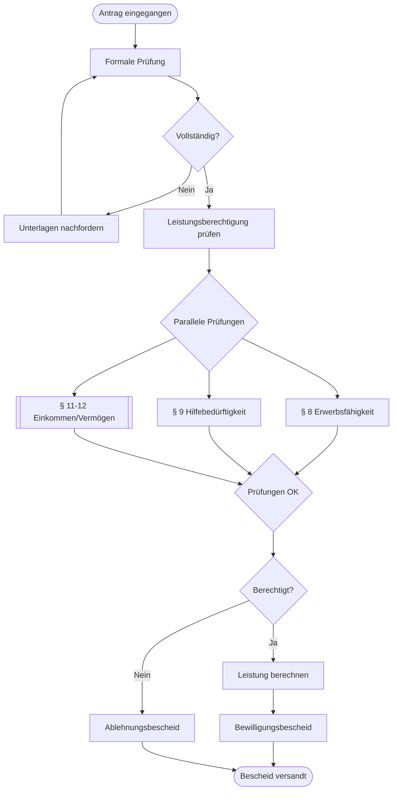
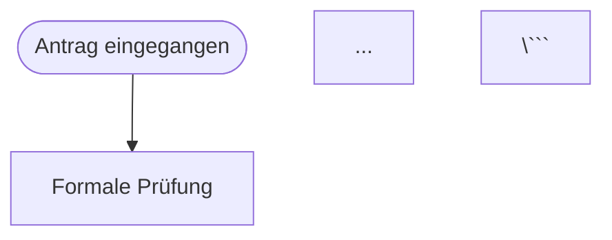

# BPMN 2.0 Prozess-Visualisierung für Sachbearbeiter

**BPMN-basierte Prozessmodellierung für Sozialrechts-Fallbearbeitung**

---

## 🎯 Übersicht

Dieses System generiert **BPMN 2.0 konforme** Prozessdiagramme für typische Sozialrechts-Fälle.

**Zielgruppe**: Sachbearbeiter in Jobcentern, Sozialämtern, Arbeitsagenturen

**Zweck**:
- Visualisierung komplexer Entscheidungspfade
- Rechtssichere Prozess-Dokumentation
- Schulungsmaterial für neue Mitarbeiter
- Qualitätssicherung und Prozessoptimierung

---

## 📊 Verfügbare Prozess-Templates

### 1. SGB II - Antragstellung und Bewilligung
**Datei**: `processes/SGB_II_Antragstellung.bpmn`

**Prozess-Schritte**:
1. Antrag eingegangen
2. Formale Prüfung (§ 37, SGB X § 16)
3. ❓ Vollständig? → Nein: Nachforderung (§ 60)
4. Sachliche Prüfung:
   - ⚡ Erwerbsfähigkeit (§ 8)
   - ⚡ Hilfebedürftigkeit (§ 9)
   - ⚡ Einkommen/Vermögen (§ 11, § 12)
5. ❓ Leistungsberechtigt?
   - Ja: Bewilligung (§ 19-22)
   - Nein: Ablehnung
6. Bescheid erstellen (SGB X § 33)

**Rechtliche Grundlagen**: SGB II § 7-12, § 19-22, SGB X § 16, § 33, § 60

**Visualisierung (Mermaid)**:


---

### 2. SGB II - Sanktionsverfahren
**Datei**: `processes/SGB_II_Sanktionsverfahren.bpmn`

**Prozess-Schritte**:
1. Pflichtverletzung festgestellt
2. Anhörung (SGB X § 24 - Rechtliches Gehör)
3. ❓ Triftiger Grund? → Ja: Keine Sanktion
4. ❓ Wiederholte Pflichtverletzung?
   - Erstmalig: 30% Minderung (§ 31a)
   - Wiederholt: 60-100% Minderung (§ 31b)
5. Sanktionsbescheid erlassen

**Rechtliche Grundlagen**: SGB II § 31, § 31a, § 31b, SGB X § 24, § 33

**Besonderheiten**:
- ⚠️ Rechtliches Gehör ist PFLICHT (§ 24 SGB X)
- ⚠️ Triftiger Grund schließt Sanktion aus
- ⚠️ Verschärfung bei Wiederholung innerhalb 1 Jahr

---

### 3. SGB XII - Grundsicherung im Alter
**Datei**: `processes/SGB_XII_Grundsicherung_Alter.bpmn`

**Prozess-Schritte**:
1. Antrag auf Grundsicherung im Alter
2. ❓ Mindestalter erreicht? (67 Jahre / Erwerbsminderung)
   - Nein: Verweis auf SGB II
3. Bedarfsermittlung (§ 27-29, § 42)
4. ⚡ Parallel:
   - Renteneinkommen abfragen (DRV)
   - Vermögen prüfen (§ 90)
5. Grundsicherung berechnen
6. Bescheid erstellen

**Rechtliche Grundlagen**: SGB XII § 41, § 27-29, § 42, § 90

**DRV-Schnittstelle**: Automatischer Renten-Abruf erforderlich

---

### 4. SGB III - Arbeitsvermittlung
**Datei**: `processes/SGB_III_Arbeitsvermittlung.bpmn`

**Prozess-Schritte**:
1. Arbeitslos gemeldet
2. Profiling / Kompetenzfeststellung (§ 37)
3. ❓ Vermittlungshemmnisse?
   - Ja: Fördermaßnahme (§ 45 MAG, § 81 FbW)
   - Nein: Direkte Vermittlung
4. Stellenangebote vermitteln
5. ❓ Vermittelt?
   - Ja: Arbeitsverhältnis
   - Nein: Zurück zu Profiling

**Rechtliche Grundlagen**: SGB III § 37, § 44, § 45, § 81

**Besonderheiten**: Iterativer Prozess (Schleife bei Nicht-Vermittlung)

---

## 🔧 Verwendung

### Option 1: BPMN 2.0 XML (Professionelle Tools)

**Camunda Modeler** (Empfohlen):
```bash
# Download: https://camunda.com/download/modeler/
# Öffne: processes/SGB_II_Antragstellung.bpmn
```

**Signavio Process Editor**:
- Import BPMN 2.0 XML
- Erweiterte Modellierung möglich

**Bizagi Modeler**:
- Kostenlos
- Import/Export BPMN 2.0

### Option 2: Mermaid.js (Markdown/Dokumentation)

**In Markdown einbinden**:
```markdown
# Prozess: SGB II Antragstellung



**Mermaid Live Editor**: https://mermaid.live
- Paste .mmd Datei
- Interaktive Bearbeitung
- Export als PNG/SVG

### Option 3: Neo4j Cypher (Dynamische Generierung)

```cypher
// Prozess als Graph speichern
CREATE (p:Process {name: "SGB II Antragstellung", sgb: "II"})
CREATE (s:Step {name: "Antrag prüfen", type: "UserTask", sgb_ref: "§ 37"})
CREATE (g:Gateway {name: "Vollständig?", type: "Exclusive"})
CREATE (p)-[:STARTS_WITH]->(s)
CREATE (s)-[:NEXT]->(g)
```

---

## 📋 Prozess-Generator API

### Python API verwenden

```python
from src.bpmn_prozess_generator import SozialrechtBPMNGenerator

# Neuen Prozess erstellen
bpmn = SozialrechtBPMNGenerator()

# Start
start = bpmn.add_start_event("Widerspruch eingegangen")

# Task
task1 = bpmn.add_user_task(
    "Widerspruch prüfen",
    assignee="Widerspruchsstelle",
    sgb_ref="SGB X § 84-86"
)
bpmn.add_sequence_flow(start, task1)

# Gateway
gw1 = bpmn.add_exclusive_gateway(
    "Begründet?",
    decision_criteria="Formelle + materielle Prüfung"
)
bpmn.add_sequence_flow(task1, gw1)

# Ja-Zweig
task_abhilfe = bpmn.add_user_task(
    "Abhilfe gewähren",
    sgb_ref="SGB X § 85 Abs. 3"
)
bpmn.add_sequence_flow(gw1, task_abhilfe, "Ja - Begründet")

# Nein-Zweig
task_ablehnung = bpmn.add_user_task(
    "Widerspruchsbescheid erlassen",
    sgb_ref="SGB X § 85 Abs. 4"
)
bpmn.add_sequence_flow(gw1, task_ablehnung, "Nein - Unbegründet")

# End
end = bpmn.add_end_event("Widerspruchsverfahren abgeschlossen")
bpmn.add_sequence_flow(task_abhilfe, end)
bpmn.add_sequence_flow(task_ablehnung, end)

# Export
bpmn.generate_bpmn_xml()  # BPMN 2.0 XML
bpmn.generate_mermaid()   # Mermaid Diagram
```

---

## 🎯 Anwendungsfälle für Sachbearbeiter

### 1. Schulung neuer Mitarbeiter
**Problem**: Komplexe Rechtsabläufe schwer zu vermitteln
**Lösung**: Visualisierte Prozesse mit Rechtsgrundlagen

**Beispiel**: SGB II Antragstellung
- Alle Prüfschritte visualisiert
- Rechtliche Grundlagen verlinkt (§ 7-12)
- Entscheidungskriterien klar dokumentiert

### 2. Qualitätssicherung
**Problem**: Fehlerhafte Bescheide durch vergessene Prüfschritte
**Lösung**: Checklisten-artige Prozessführung

**Beispiel**: SGB II Sanktionsverfahren
- ✅ Anhörung durchgeführt? (§ 24 Pflicht!)
- ✅ Triftiger Grund geprüft?
- ✅ Wiederholung geprüft?

### 3. Prozessoptimierung
**Problem**: Lange Bearbeitungszeiten
**Lösung**: Parallelisierungspotenziale erkennen

**Beispiel**: Grundsicherung im Alter
- ⚡ Rentenabruf + Vermögensprüfung parallel
- Zeit sparen durch Automatisierung (DRV-Schnittstelle)

### 4. Rechtssichere Dokumentation
**Problem**: Nachvollziehbarkeit von Entscheidungen
**Lösung**: Prozess-Logs mit Rechtsgrundlagen

**Beispiel**: Jeder Schritt hat § Referenz
- "Erwerbsfähigkeit geprüft gemäß SGB II § 8"
- Audit-Trail für Widersprüche

---

## 🗺️ Erweiterte Prozess-Modellierung

### Integration mit Neo4j

```cypher
// 1. Prozess-Template erstellen
CREATE (p:ProcessTemplate {
  id: "SGB_II_Antrag",
  name: "SGB II Antragstellung",
  sgb: "II",
  avg_duration_days: 7,
  rechtliche_grundlagen: ["§ 7", "§ 8", "§ 9", "§ 11", "§ 12"]
})

// 2. Prozess-Schritte
CREATE (s1:ProcessStep {
  id: "Schritt_1",
  name: "Formale Prüfung",
  type: "UserTask",
  assignee_role: "Sachbearbeiter Eingangszone",
  rechtliche_grundlage: "SGB II § 37",
  estimated_minutes: 15
})

// 3. Entscheidungen
CREATE (g1:ProcessGateway {
  id: "Gateway_1",
  name: "Antrag vollständig?",
  type: "Exclusive",
  decision_criteria: "Alle Pflichtfelder ausgefüllt + Nachweise vorhanden"
})

// 4. Verbindungen
CREATE (p)-[:STARTS_WITH]->(s1)
CREATE (s1)-[:NEXT]->(g1)
CREATE (g1)-[:IF_TRUE {condition: "Vollständig"}]->(s2)
CREATE (g1)-[:IF_FALSE {condition: "Unvollständig"}]->(nachforderung)

// 5. Rechtsgrundlagen verlinken
MATCH (s:ProcessStep {id: "Schritt_1"})
MATCH (d:Document {sgb_nummer: "II"})-[:CONTAINS_PARAGRAPH]->(par:Paragraph {paragraph_nummer: "37"})
CREATE (s)-[:RECHTLICHE_GRUNDLAGE]->(par)
```

### Dynamische Prozess-Generierung

```python
def generate_prozess_from_neo4j(fall_typ: str, sgb: str) -> BPMNGenerator:
    """
    Generiere Prozess basierend auf Neo4j-Regeln

    Args:
        fall_typ: "Neuantrag", "Weiterbewilligung", "Widerspruch"
        sgb: "II", "III", "XII"

    Returns:
        BPMN Generator mit dynamisch generiertem Prozess
    """
    # Query Neo4j für Prozess-Regeln
    with neo4j_session() as session:
        result = session.run("""
            MATCH (pt:ProcessTemplate {sgb: $sgb, typ: $typ})
            MATCH (pt)-[:HAS_STEP]->(step)
            OPTIONAL MATCH (step)-[:RECHTLICHE_GRUNDLAGE]->(para:Paragraph)
            RETURN step, para
            ORDER BY step.order
        """, sgb=sgb, typ=fall_typ)

        # Build BPMN from Neo4j data
        bpmn = SozialrechtBPMNGenerator()
        for record in result:
            # Add steps dynamically
            pass

    return bpmn
```

---

## 📚 Prozess-Bibliothek

### SGB II (Bürgergeld/Grundsicherung für Arbeitsuchende)

| Prozess | Datei | Komplexität | Dauer Ø |
|---------|-------|-------------|---------|
| Antragstellung | SGB_II_Antragstellung.bpmn | Hoch | 7 Tage |
| Sanktionsverfahren | SGB_II_Sanktionsverfahren.bpmn | Mittel | 2 Wochen |
| Weiterbewilligung | (TODO) | Niedrig | 3 Tage |
| Widerspruch | (TODO) | Hoch | 4 Wochen |
| Eingliederungsvereinbarung | (TODO) | Mittel | 2 Wochen |

### SGB III (Arbeitsförderung)

| Prozess | Datei | Komplexität | Dauer Ø |
|---------|-------|-------------|---------|
| Arbeitsvermittlung | SGB_III_Arbeitsvermittlung.bpmn | Mittel | Variabel |
| Weiterbildungsförderung | (TODO) | Hoch | 2 Monate |
| Gründungszuschuss | (TODO) | Mittel | 4 Wochen |

### SGB XII (Sozialhilfe)

| Prozess | Datei | Komplexität | Dauer Ø |
|---------|-------|-------------|---------|
| Grundsicherung im Alter | SGB_XII_Grundsicherung_Alter.bpmn | Mittel | 10 Tage |
| Hilfe zur Pflege | (TODO) | Hoch | 3 Wochen |
| Eingliederungshilfe | (TODO) | Sehr Hoch | 6 Wochen |

---

## 🔍 Fall-spezifische Prozess-Anpassung

### Beispiel: Alleinerziehend mit Kind unter 3 Jahren

```python
# Basis-Prozess laden
bpmn = create_sgb2_antrag_prozess()

# Spezifische Anpassungen für diesen Fall
# 1. Mehrbedarf für Alleinerziehende (§ 21 Abs. 3)
task_mehrbedarf = bpmn.add_user_task(
    "Mehrbedarf Alleinerziehende berechnen",
    sgb_ref="SGB II § 21 Abs. 3 Nr. 1 (36% für Kind unter 7)"
)

# 2. Bildung und Teilhabe prüfen
task_but = bpmn.add_user_task(
    "Anspruch auf Bildung und Teilhabe prüfen",
    sgb_ref="SGB II § 28"
)

# In Prozess einfügen (nach Leistungsberechnung)
# ...
```

### Beispiel: SGB III mit Behinderung

```python
# Spezial-Prozess für Menschen mit Behinderung
bpmn = SozialrechtBPMNGenerator()

# Zusätzlicher Schritt
task_reha = bpmn.add_user_task(
    "Rehabilitations-Träger prüfen",
    sgb_ref="SGB III § 19, SGB IX § 6a"
)

# Gateway: Welcher Träger?
gw_traeger = bpmn.add_exclusive_gateway(
    "Zuständiger Reha-Träger?",
    decision_criteria="SGB IX § 14 ff."
)

# Verzweigungen für verschiedene Träger
# - Bundesagentur (SGB III)
# - Rentenversicherung (SGB VI)
# - Unfallversicherung (SGB VII)
# ...
```

---

## 🚀 Nächste Schritte

### Geplante Erweiterungen

1. **Weitere Prozesse**:
   - SGB II Weiterbewilligung
   - SGB II Widerspruchsverfahren
   - SGB III Berufsausbildungsbeihilfe
   - SGB XII Hilfe zur Pflege
   - SGB VI Rentenantrag

2. **Neo4j Integration**:
   - Prozess-Templates in Neo4j speichern
   - Dynamische Generierung aus Fachlichen Weisungen
   - Verlinkung mit Rechtsparagraphen

3. **Interaktive Visualisierung**:
   - Web-UI mit bpmn.io
   - Click auf Schritt → Zeigt relevante Weisungen
   - Fortschritts-Tracking für echte Fälle

4. **Prozess-Analytics**:
   - Durchlaufzeiten analysieren
   - Bottlenecks identifizieren
   - Fehlerquellen erkennen

---

## 📖 Legende: BPMN Elemente

### Events (Ereignisse)
- `([Start])` - Start Event (Prozessbeginn)
- `([End])` - End Event (Prozessende)

### Activities (Aktivitäten)
- `[User Task]` - Manuelle Aufgabe (Sachbearbeiter)
- `[[Service Task]]` - Automatisierte Aufgabe (System)

### Gateways (Verzweigungen)
- `{Exclusive?}` - XOR-Gateway (eine Option)
- `{Parallel}` - AND-Gateway (alle parallel)

### Flows (Verbindungen)
- `-->` - Sequence Flow (Ablauf)
- `-->|Bedingung|` - Conditional Flow (mit Bedingung)

---

## ⚖️ Rechtliche Hinweise

**Verwendungszweck**:
- ✅ Interne Prozess-Dokumentation
- ✅ Schulung und Training
- ✅ Qualitätssicherung

**KEIN Ersatz** für:
- ❌ Rechtliche Beratung
- ❌ Offizielle Verwaltungsvorschriften
- ❌ Dienstanweisungen der Behörde

**Bei Widersprüchen**: Fachliche Weisungen und Gesetze haben Vorrang!

---

## 🛠️ Tools und Software

### BPMN Modeler (Kostenlos)
- **Camunda Modeler**: https://camunda.com/download/modeler/
- **bpmn.io**: https://bpmn.io/
- **Bizagi Modeler**: https://www.bizagi.com/

### Online-Editoren
- **Mermaid Live**: https://mermaid.live/
- **draw.io** (mit BPMN Plugin): https://app.diagrams.net/

### Execution Engines (Optional)
- **Camunda Platform**: Prozess-Automatisierung
- **Flowable**: Open-Source BPM
- **Activiti**: Lightweight BPM

---

**Erstellt**: 2025-10-10
**Autor**: ma3u
**Version**: 1.0.0
**GitHub**: https://github.com/ma3u/Sozialrecht_RAG
