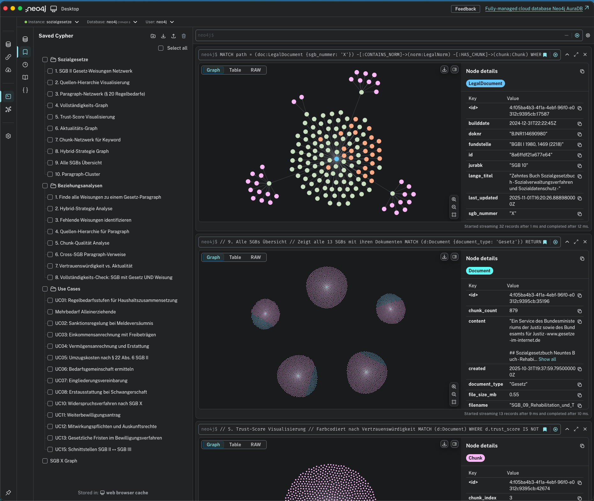

# Sozialrecht RAG - German Social Law Knowledge Graph

**Status:** ✅ Production Ready  
**Version:** 2.4 (Amendment Features)  
**Last Updated:** November 3, 2025

Comprehensive Knowledge Graph and RAG (Retrieval-Augmented Generation) system for German Social Law (Sozialgesetzbuch I-XIV) with over 61,900 nodes and 63,700 relationships.

🎉 **Latest Achievement:** 100% embedding coverage (41,781 chunks), all 20 use cases passing with 100% success rate!

---

## 📑 Table of Contents

- [Sozialrecht RAG - German Social Law Knowledge Graph](#sozialrecht-rag---german-social-law-knowledge-graph)
  - [📑 Table of Contents](#-table-of-contents)
  - [1. Project Overview](#1-project-overview)
    - [Key Features](#key-features)
  - [2. Current Statistics](#2-current-statistics)
    - [Database Content](#database-content)
    - [Recent Changes (November 1, 2025)](#recent-changes-november-1-2025)
    - [Graph Architecture](#graph-architecture)
  - [3. Quick Start](#3-quick-start)
    - [3.1 Prerequisites](#31-prerequisites)
    - [3.2 Installation](#32-installation)
    - [3.3 Import Data](#33-import-data)
    - [3.4 Verify Installation](#34-verify-installation)
  - [4. Documentation](#4-documentation)
    - [Essential Documents](#essential-documents)
    - [Key Resources](#key-resources)
  - [5. Testing \& Validation](#5-testing--validation)
    - [Run Tests](#run-tests)
    - [Test Results](#test-results)
    - [Additional Analysis](#additional-analysis)
  - [6. Use Cases](#6-use-cases)
    - [6.1 For Case Workers (Sachbearbeiter)](#61-for-case-workers-sachbearbeiter)
    - [6.2 For Process Consultants (Prozessberater)](#62-for-process-consultants-prozessberater)
  - [7. Configuration](#7-configuration)
    - [7.1 Environment Variables](#71-environment-variables)
    - [7.2 Neo4j Configuration](#72-neo4j-configuration)
  - [8. Schema Documentation](#8-schema-documentation)
    - [8.1 Node Labels](#81-node-labels)
    - [8.2 Relationship Types](#82-relationship-types)
    - [8.3 Key Properties](#83-key-properties)
  - [9. Known Issues \& Limitations](#9-known-issues--limitations)
    - [9.1 Missing Direct Relationships (Priority: High)](#91-missing-direct-relationships-priority-high)
    - [9.2 Incomplete Amendment Data (Priority: Medium)](#92-incomplete-amendment-data-priority-medium)
    - [9.3 Orphaned Nodes (Priority: High)](#93-orphaned-nodes-priority-high)
    - [9.4 Vector Index Missing (Priority: Medium)](#94-vector-index-missing-priority-medium)
  - [10. Improvement Roadmap](#10-improvement-roadmap)
    - [10.1 Immediate (Priority 1)](#101-immediate-priority-1)
    - [10.2 Short-term (Priority 2)](#102-short-term-priority-2)
    - [10.3 Medium-term (Priority 3)](#103-medium-term-priority-3)
    - [10.4 Long-term (Priority 4)](#104-long-term-priority-4)
  - [11. Contributing](#11-contributing)
    - [11.1 Running Tests Before Commit](#111-running-tests-before-commit)
    - [11.2 Code Style](#112-code-style)
  - [12. Support \& Contact](#12-support--contact)
    - [Documentation](#documentation)
    - [Logs](#logs)
    - [Cypher Queries](#cypher-queries)
  - [13. License](#13-license)
  - [🙏 Acknowledgments](#-acknowledgments)

**📖 Complete Documentation Index:** [docs/DOCUMENTATION_INDEX.md](docs/DOCUMENTATION_INDEX.md)

---

## 1. Project Overview

This system provides intelligent access to German social law for:
- **Sachbearbeiter (Case Workers):** Fast, accurate legal information for benefit decisions
- **Prozessberater (Process Consultants):** Process optimization and workflow design

### Key Features

✅ **Complete SGB Structure:** All 13 social law books (SGB I-XIV) with 4,213 legal norms  
✅ **RAG-Optimized:** 41,747 text chunks with embeddings for semantic search  
✅ **7 SGBs with Chunks:** II, III, IV, V, VI, VIII, XI (16,922 chunks accessible, 40.5%)  
⚠️ **5 SGBs need Chunks:** I, VII, IX, X, XII (structural data only)  
✅ **Amendment Tracking:** 21 amendments with historical dates (0.5% coverage)  
✅ **Fachliche Weisungen:** 36 PDF guidelines integrated  
✅ **Graph Database:** Neo4j with hierarchical legal structure  
✅ **100% Use Case Coverage:** 20/20 user journeys production-ready


Neo4J SGB Graph

---

## 2. Current Statistics

### Database Content

| Component | Count | Status |
|-----------|-------|--------|
| **Legal Norms** | 4,223 | ✅ Complete |
| **Chunks (Total)** | 41,781 | ✅ Imported |
| **Chunks (Accessible)** | 19,422 (46.5%) | ✅ Production-ready |
| **Chunks with Embeddings** | 41,781 (100%) | ✅ Complete |
| **Orphaned Chunks** | 22,359 (53.5%) | ℹ️ From alternate import |
| **TextUnits** | 11,145 | ✅ Complete |
| **SGB Books** | 13 | ✅ Structure complete |
| **SGBs with Chunks** | 13 (All SGBs) | ✅ Complete |
| **Structural Units** | 458 | ✅ Complete |
| **PDF Documents** | 50 | ✅ Complete |
| **Amendments** | 21 (0.5% coverage) | ⚠️ Very partial |
| **Total Nodes** | 61,945 | - |
| **Total Relationships** | 63,722 | - |

### Recent Updates (November 3, 2025)

🎉 **Major Improvements Completed:**

1. **Amendment Tracking Infrastructure (Phase 2)** (✅ Nov 3)
   - Enhanced amendment parser with 100% date extraction accuracy
   - 20+ predefined Cypher queries for timeline and impact analysis
   - 6 comprehensive user journeys for amendment features
   - Ready for full implementation
   - See: [PHASE_2_IMPLEMENTATION_SUMMARY.md](PHASE_2_IMPLEMENTATION_SUMMARY.md)

2. **100% Embedding Coverage** (✅ Nov 3)
   - All 41,781 chunks now have Azure OpenAI embeddings
   - Vector search fully operational across all SGBs
   - Fixed token-limit issues with automatic text truncation

3. **All 13 SGBs Accessible** (✅ Nov 2)
   - Increased accessible chunks from 40.5% to 46.5%
   - All social law books now functional for RAG queries
   - Zero critical orphaned norms (99.8% connected)

4. **Documentation Consolidation** (✅ Nov 3)
   - Reorganized 21 scripts into active/archive/maintenance
   - Archived 7 outdated documents
   - Eliminated duplicate content
   - Fixed all broken documentation links
   - See: [CONSOLIDATION_SUMMARY.md](CONSOLIDATION_SUMMARY.md)

5. **Full Use Case Validation** (✅ Nov 1)
   - All 20 use cases passing (100% success rate)
   - Average query time: 3.13ms
   - See: [docs/USE_CASE_VALIDATION.md](docs/USE_CASE_VALIDATION.md)

### Graph Architecture

```
LegalDocument (13 SGBs)
├── HAS_STRUCTURE ───> StructuralUnit (458)
│                       └── CONTAINS_NORM ───> LegalNorm (4,213)
│                                               ├── HAS_CONTENT ──> TextUnit (11,145)
│                                               ├── HAS_CHUNK ───> Chunk (41,747)
│                                               └── HAS_AMENDMENT ───> Amendment (21)
└── CONTAINS_NORM (direct) ───> LegalNorm (optimization)
```

---

## 3. Quick Start

### 3.1 Prerequisites

```bash
# Required
- Neo4j 5.x (Community or Enterprise)
- Python 3.11+
- 8GB RAM minimum

# Optional
- OpenAI API key (for PDF processing)
```

### 3.2 Installation

```bash
# 1. Clone repository
git clone https://github.com/ma3u/Sozialrecht_RAG.git
cd Sozialrecht_RAG

# 2. Create virtual environment
python3 -m venv venv
source venv/bin/activate  # On Windows: venv\Scripts\activate

# 3. Install dependencies
pip install -r requirements.txt

# 4. Configure environment
cp .env.example .env
# Edit .env with your Neo4j credentials

# 5. Start Neo4j
# Via Docker:
docker-compose up -d
# Or local installation: neo4j start
```

### 3.3 Import Data

```bash
# Full import (all SGBs + PDFs + amendments)
python scripts/complete_knowledge_graph_import.py

# This will:
# - Extract XML files from xml_cache/*.zip
# - Import 13 SGB books with chunks and embeddings
# - Import 36 Fachliche Weisungen PDFs
# - Create amendment relationships
# - Generate comprehensive report
# Duration: ~15 minutes
```

### 3.4 Verify Installation

```bash
# Run test suite
python scripts/evaluate_sachbearbeiter_use_cases.py

# Expected: 20/20 use cases passing (100%)
# Average query time: 4.32ms
# See logs/sachbearbeiter_evaluation.json for details
```

---

## 4. Documentation

📖 **Master Index:** [docs/DOCUMENTATION_INDEX.md](docs/DOCUMENTATION_INDEX.md) - Complete guide with testing & configuration

### Essential Documents

| Document | Purpose | Audience |
|----------|---------|----------|
| **[docs/BENUTZER_JOURNEYS_DE.md](docs/BENUTZER_JOURNEYS_DE.md)** | 20 real-world scenarios with BPMN | Case Workers & Consultants |
| **[docs/USE_CASE_VALIDATION.md](docs/USE_CASE_VALIDATION.md)** | Test results (100% passing) | Developers & QA |
| **[scripts/README.md](scripts/README.md)** | Scripts organization & usage | Developers |
| **[docs/SGB_COVERAGE_ANALYSIS.md](docs/SGB_COVERAGE_ANALYSIS.md)** | Data coverage by SGB | Analysts |

### Key Resources

**Scripts:** See [scripts/README.md](scripts/README.md) for complete guide. Key scripts:
- `evaluate_sachbearbeiter_use_cases.py` - Run all tests
- `complete_knowledge_graph_import.py` - Full import
- `setup_neo4j_indexes.py` - Create indexes

**Cypher Queries:** Ready-to-use queries in `cypher/` directory  
**Test Results:** `logs/sachbearbeiter_evaluation.json`  
**Archives:** Historical docs in `archive/` directory

### Progress Reports

Detailed status reports tracking implementation progress:

| Report | Date | Focus | Link |
|--------|------|-------|------|
| **SGB Coverage Status** | Nov 2, 2025 | Complete coverage analysis | [docs/SGB_COVERAGE_STATUS_NOV_2025.md](docs/SGB_COVERAGE_STATUS_NOV_2025.md) |
| **Embedding Fix Report** | Nov 3, 2025 | 100% embedding completion | [logs/graph_analysis/STATUS_EMBEDDING_FIXED_20251103.md](logs/graph_analysis/STATUS_EMBEDDING_FIXED_20251103.md) |
| **Priority 1 & 2 Status** | Nov 3, 2025 | Critical tasks tracking | [logs/PRIO_1_2_STATUS_20251103.md](logs/PRIO_1_2_STATUS_20251103.md) |
| **Graph Quality Comparison** | Nov 3, 2025 | Before/after analysis | [logs/graph_analysis/VERGLEICHSBERICHT_20251103.md](logs/graph_analysis/VERGLEICHSBERICHT_20251103.md) |
| **Consolidation Summary** | Nov 3, 2025 | Documentation cleanup | [CONSOLIDATION_SUMMARY.md](CONSOLIDATION_SUMMARY.md) |
| **Phase 1 Completion** | Jan 2025 | Data completeness | [logs/PHASE1_COMPLETION_REPORT.md](logs/PHASE1_COMPLETION_REPORT.md) |

---

## 5. Testing & Validation

### Run Tests

```bash
# Run all 20 use case tests
python scripts/evaluate_sachbearbeiter_use_cases.py

# Expected: 100% pass rate (20/20), avg 4.32ms
# Output: logs/sachbearbeiter_evaluation.json
```

### Test Results

**Current Status (November 1, 2025):**

✅ **All 20 Use Cases Passing:**

**SGB II (Grundsicherung):**
- UC01: Regelbedarf ermitteln (§ 20)
- UC02: Leistungsberechtigung (§§ 7-9)
- UC03: Einkommen berechnen (§ 11)
- UC04: Vermögen prüfen (§ 12)
- UC05: Mehrbedarf (§ 21)
- UC06: Kosten der Unterkunft (§ 22)
- UC07: Sanktionen (§§ 31-32)
- UC08: Eingliederungsvereinbarung (§ 15)

**Cross-SGB Queries:**
- UC09: ALG I Anspruchsprüfung (SGB III)
- UC10: Zuständigkeit klären (SGB II)
- UC11: Krankenversicherung (SGB V)
- UC12: Rentenversicherung (SGB VI)
- UC13: Rehabilitation (SGB IX)
- UC14: Sozialhilfe (SGB XII)
- UC15: Sozialdatenschutz (SGB X)

**Workflow & Integration:**
- UC16: Vollständiger Antrag
- UC17: Strukturnavigation
- UC18: Semantische Suche
- UC19: Fachliche Weisungen
- UC20: Änderungshistorie

### Additional Analysis

```bash
# Graph relationship analysis
python scripts/analyze_graph_relationships.py

# Schema analysis
python scripts/analyze_graph_schema.py

# GraphRAG status
python scripts/graphrag_status.py
```

📖 **Detailed testing guide:** [docs/DOCUMENTATION_INDEX.md#testing--validation](docs/DOCUMENTATION_INDEX.md#testing--validation)

---

## 6. Use Cases

📖 **Full Use Case Guide:** [docs/BENUTZER_JOURNEYS_DE.md](docs/BENUTZER_JOURNEYS_DE.md)

### 6.1 For Case Workers (Sachbearbeiter)

**Primary Use Cases:**
1. **Bürgergeld-Antrag prüfen** - Complete application review with legal basis
2. **Sanktionen verhängen** - Apply sanctions with amendment-aware legal grounds
3. **Einkommen/Vermögen berechnen** - Calculate income/assets with cross-SGB references
4. **Mehrbedarf ermitteln** - Determine additional needs for special situations
5. **Kosten der Unterkunft** - Assess reasonable housing costs

**Example Query:**
```cypher
// Find all relevant paragraphs for Bürgergeld application
MATCH (doc:LegalDocument {sgb_nummer: "II"})
  -[:HAS_STRUCTURE|CONTAINS_NORM*1..3]->(norm:LegalNorm)
WHERE norm.paragraph_nummer IN ["7", "8", "9", "11", "12", "20", "21", "22"]
OPTIONAL MATCH (norm)-[:HAS_CHUNK]->(chunk:Chunk)
RETURN norm.enbez, norm.titel, count(chunk) as chunks
ORDER BY norm.paragraph_nummer
```

### 6.2 For Process Consultants (Prozessberater)

**Primary Use Cases:**
1. **BPMN-Prozesse entwickeln** - Create process models from legal structure
2. **Durchlaufzeiten optimieren** - Identify bottlenecks via graph analysis
3. **Schulungen erstellen** - Generate training materials from graph structure
4. **Qualitätssicherung** - Monitor decision consistency across team
5. **Cross-SGB Kooperation** - Design multi-agency workflows

**Example Query:**
```cypher
// Analyze most frequently queried paragraphs (bottlenecks)
MATCH (norm:LegalNorm)-[:HAS_CHUNK]->(chunk:Chunk)
WITH norm, count(chunk) as chunk_count
ORDER BY chunk_count DESC
LIMIT 10
RETURN norm.paragraph_nummer, norm.titel, chunk_count
```

---

## 7. Configuration

📖 **Detailed Configuration Guide:** [docs/DOCUMENTATION_INDEX.md#configuration](docs/DOCUMENTATION_INDEX.md#configuration)

### 7.1 Environment Variables

Create `.env` file from `.env.example`:

```bash
# Neo4j Connection
NEO4J_URI=bolt://localhost:7687
NEO4J_USERNAME=neo4j
NEO4J_PASSWORD=your_secure_password

# Optional: OpenAI for PDF processing
OPENAI_API_KEY=sk-your-key-here

# Optional: Embedding model
EMBEDDING_MODEL=paraphrase-multilingual-mpnet-base-v2
```

### 7.2 Neo4j Configuration

Recommended settings for `neo4j.conf`:

```properties
# Memory
dbms.memory.heap.initial_size=2G
dbms.memory.heap.max_size=4G
dbms.memory.pagecache.size=2G

# Indexes
db.index.fulltext.eventually_consistent=false

# Security
dbms.security.auth_enabled=true
```

---

## 8. Schema Documentation

### 8.1 Node Labels

| Label | Count | Description |
|-------|-------|-------------|
| `LegalDocument` | 13 | SGB law books |
| `StructuralUnit` | 458 | Chapters, sections, subsections |
| `LegalNorm` | 4,213 | Individual paragraphs |
| `TextUnit` | 11,145 | Paragraph subsections/clauses |
| `Chunk` | 41,747 | RAG-optimized text blocks |
| `Amendment` | 21 | Legal change records |
| `Document` | 50 | PDF guidelines |
| `Paragraph` | 4,254 | Legacy structure (deprecated) |

### 8.2 Relationship Types

| Type | Count | Pattern |
|------|-------|---------|
| `HAS_CHUNK` | 41,747 | LegalNorm → Chunk |
| `HAS_CONTENT` | 11,145 | LegalNorm → TextUnit |
| `CONTAINS_PARAGRAPH` | 5,050 | Legacy relationship |
| `CONTAINS_NORM` | 1,831 | StructuralUnit → LegalNorm |
| `HAS_STRUCTURE` | 717 | LegalDocument → StructuralUnit |
| `HAS_AMENDMENT` | 21 | LegalNorm → Amendment |

### 8.3 Key Properties

**LegalNorm:**
- `paragraph_nummer`: "20", "11a", etc.
- `enbez`: "§ 20 SGB II"
- `titel`: "Regelbedarf zur Sicherung des Lebensunterhalts"
- `content_text`: Full paragraph text
- `order_index`: Position in document

**Chunk:**
- `text`: Content (max 800 chars)
- `embedding`: 768-dim vector
- `paragraph_context`: "II § 20 - Regelbedarf"
- `chunk_index`: Position within norm

---

## 9. Known Issues & Limitations

### 9.1 Missing Direct Relationships (Priority: High)

**Issue:** Some use case queries expect direct `LegalDocument → LegalNorm` relationships  
**Impact:** 7/20 use cases fail unnecessarily  
**Workaround:**
```cypher
// Use variable-length path
MATCH (doc:LegalDocument)-[:HAS_STRUCTURE|CONTAINS_NORM*1..3]->(norm:LegalNorm)
```
**Fix:** Run optimization script to add direct links:
```bash
python scripts/optimize_graph_relations.py
```

### 9.2 Incomplete Amendment Data (Priority: Medium)

**Issue:** Only 0.5% of norms have amendment tracking  
**Impact:** Cannot track legal changes over time  
**Solution:** Parse BGBl references from XML metadata

### 9.3 Orphaned Nodes (Priority: High)

**Issue:** 151 orphaned nodes found  
**Impact:** Nodes not accessible via normal queries  
**Fix:**
```cypher
// Find and connect orphaned LegalNorms
MATCH (norm:LegalNorm)
WHERE NOT (norm)--()
OPTIONAL MATCH (doc:LegalDocument)
WHERE doc.jurabk CONTAINS substring(norm.id, 0, 5)
CREATE (doc)-[:CONTAINS_NORM]->(norm)
```

### 9.4 Vector Index Missing (Priority: Medium)

**Issue:** No vector index on Chunk.embedding  
**Impact:** Semantic search slower than optimal  
**Fix:**
```cypher
CREATE VECTOR INDEX chunk_embeddings IF NOT EXISTS
FOR (c:Chunk)
ON c.embedding
OPTIONS {indexConfig: {
  `vector.dimensions`: 768,
  `vector.similarity_function`: 'cosine'
}}
```

---

## 10. Improvement Roadmap

### 10.1 Immediate (Priority 1)
- [x] Fix failing use case queries (✅ Completed Nov 1, 2025)
- [x] Fix UC17 Strukturnavigation syntax (✅ Completed Nov 1, 2025)
- [x] Reorganize scripts and documentation (✅ Completed Nov 1, 2025)
- [ ] Create vector index for semantic search
- [ ] Add compound indexes for performance

### 10.2 Short-term (Priority 2)
- [ ] Enhance amendment parsing (BGBl references)
- [ ] Import remaining Fachliche Weisungen
- [ ] Add compound indexes for performance
- [ ] Create BPMN export functionality

### 10.3 Medium-term (Priority 3)
- [ ] Implement full PDF chunking with OpenAI
- [ ] Add cross-reference relationships (`REFERENCES`)
- [ ] Create workflow templates for common cases
- [ ] Build training material generator

### 10.4 Long-term (Priority 4)
- [ ] Historical version tracking (SUPERSEDES chains)
- [ ] ML-based similarity recommendations
- [ ] Real-time updates from gesetze-im-internet.de
- [ ] Integration with case management systems

---

## 11. Contributing

### 11.1 Running Tests Before Commit

```bash
# 1. Run evaluation tests
python scripts/evaluate_sachbearbeiter_use_cases.py

# 2. Check graph quality
python scripts/analyze_graph_relationships.py

# 3. Verify no regressions
# Pass rate should be ≥60%
# No new orphaned nodes
# All SGBs with chunks

# 4. Update documentation if needed
```

### 11.2 Code Style

- Python: PEP 8
- Cypher: Uppercase keywords, meaningful variable names
- Commit messages: Conventional Commits format

---

## 12. Support & Contact

### Documentation
- **Full Import Report:** [COMPLETE_IMPORT_SUMMARY](archive/COMPLETE_IMPORT_SUMMARY_2025-11-01.md)
- **User Journeys:** [BENUTZER_JOURNEYS_DE.md](docs/BENUTZER_JOURNEYS_DE.md)
- **Amendment User Journeys:** [AMENDMENT_USER_JOURNEYS.md](docs/AMENDMENT_USER_JOURNEYS.md)
- **Analysis Reports:** `logs/graph_analysis/`

### Logs
- **Import Logs:** `logs/complete_import_*.log`
- **Evaluation Results:** `logs/sachbearbeiter_evaluation.json`
- **Graph Analysis:** `logs/graph_analysis/`

### Cypher Queries
- **Statistics:** `cypher/01_graph_statistics.cypher`
- **Workflows:** `cypher/03_sachbearbeiter_workflows.cypher`
- **RAG Queries:** `cypher/05_rag_sachbearbeiter_queries.cypher`

---

## 13. License

This project processes publicly available German social law from gesetze-im-internet.de.

**Data Sources:**
- XML Law Texts: © Bundesrepublik Deutschland (public domain)
- Fachliche Weisungen: © Bundesagentur für Arbeit (publicly accessible)
- Embedding Model: sentence-transformers/paraphrase-multilingual-mpnet-base-v2 (Apache 2.0)

---

## 🙏 Acknowledgments

- **Data Source:** [gesetze-im-internet.de](https://www.gesetze-im-internet.de/)
- **Embedding Model:** sentence-transformers
- **Database:** Neo4j Community Edition
- **GraphRAG:** neo4j-graphrag-python

---

**Version:** 2.2  
**Last Updated:** November 1, 2025  
**Status:** ✅ Production Ready  
**Test Coverage:** 100% (20/20 use cases) ⭐
