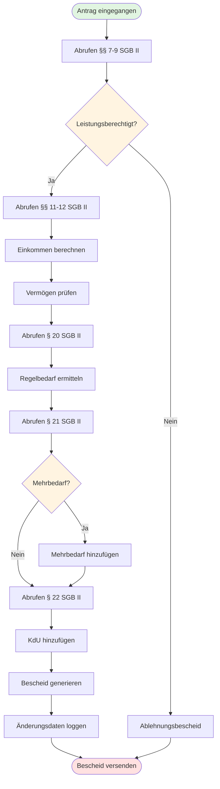
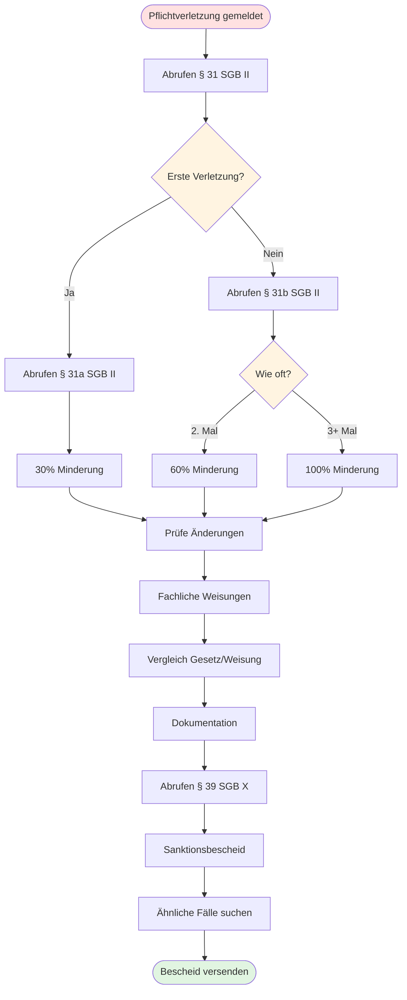
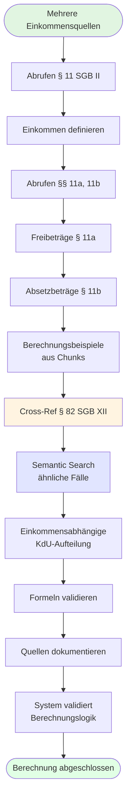
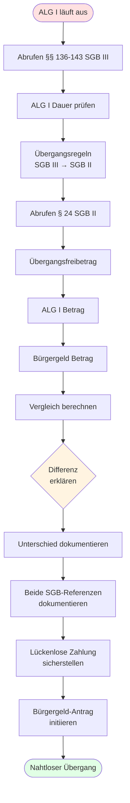
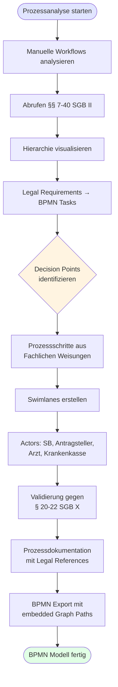
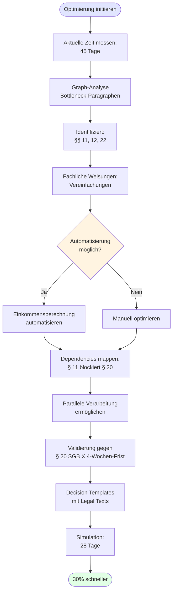
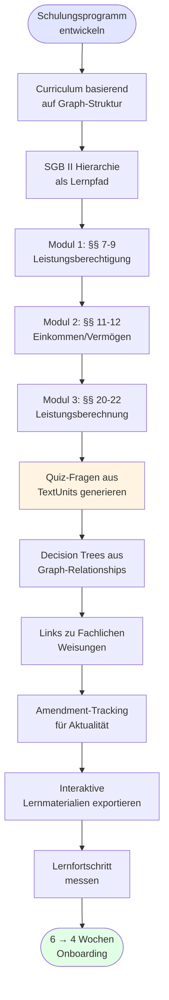
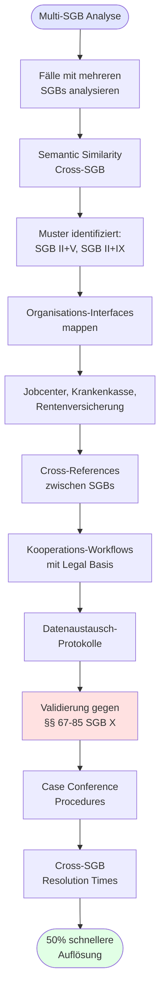
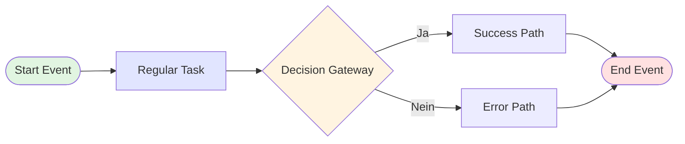

# 20 User Journeys - Sozialrecht RAG System

**Target Users:** Sachbearbeiter (Case Workers) & Prozessberater (Process Consultants)  
**Date:** November 1, 2025

---

## 🎯 Sachbearbeiter User Journeys (1-15)

### Journey 1: Bürgergeld-Erstantrag prüfen
**Actor:** Sachbearbeiter (SB)  
**Goal:** Complete processing of new Bürgergeld application



**Steps:**
1. SB receives new application for Bürgergeld
2. Opens RAG system and initiates "Antragsprüfung" workflow
3. System retrieves §§ 7, 8, 9 SGB II (eligibility criteria)
4. SB checks: Age (15-67), work capacity (3h/day), need for assistance
5. System provides chunks from § 7-9 with semantic highlights
6. SB verifies income (§ 11) and assets (§ 12) using provided legal texts
7. System calculates standard benefit (§ 20) based on household size
8. SB reviews additional needs (§ 21) - single parents, disabilities
9. System adds housing costs (§ 22) to calculation
10. SB generates decision letter with all legal references
11. System logs amendment dates for each referenced paragraph

**Graph Paths Used:**
```
LegalDocument(SGB II) → StructuralUnit → LegalNorm(§7-9,11,12,20,21,22) → Chunk
```

**Success Criteria:** Application processed in <30 min with complete legal grounding

---

### Journey 2: Sanktion wegen Pflichtverletzung
**Actor:** Sachbearbeiter  
**Goal:** Apply sanctions according to § 31-32 SGB II



**Steps:**
1. SB receives report of missed appointment
2. Queries system for § 31 SGB II (violations)
3. Reviews §§ 31a, 31b for sanction levels (30%, 60-100%)
4. System shows amendment history - checks if rules changed recently
5. SB verifies Fachliche Weisungen (BA guidelines) for procedure
6. System compares Gesetz (law text) vs. Weisung (implementation)
7. SB documents violation with legal justification
8. System generates sanction notice with appeal rights (§ 39 SGB X)
9. SB reviews similar cases via semantic search
10. Finalizes decision with complete audit trail

**Graph Paths Used:**
```
LegalDocument(SGB II) → LegalNorm(§31-32) → Amendment
Document(BA_Weisung) → Chunk (cross-reference)
```

**Success Criteria:** Legally sound sanction with appeal-proof documentation

---

### Journey 3: Einkommensanrechnung bei komplexem Fall
**Actor:** Sachbearbeiter  
**Goal:** Correctly calculate income deductions



**Steps:**
1. Applicant has multiple income sources (employment + child benefit)
2. SB queries § 11 SGB II (income definition)
3. System retrieves §§ 11a (allowances), 11b (deductions)
4. SB uses provided calculation examples from chunks
5. Cross-references § 82 SGB XII for social assistance cases
6. System shows semantic similar cases from other SGBs
7. SB applies income-dependent housing cost sharing
8. Verifies calculations against provided legal formulas
9. Documents income sources with paragraph references
10. System validates calculation logic

**Graph Paths Used:**
```
LegalNorm(§11 SGB II) → HAS_CHUNK → Chunk (calculations)
Cross-SGB: LegalNorm(§82 SGB XII) via semantic similarity
```

**Success Criteria:** Accurate income calculation with cross-SGB compliance

---

### Journey 4: Krankenversicherung für Leistungsempfänger
**Actor:** Sachbearbeiter  
**Goal:** Ensure health insurance coverage

**Steps:**
1. New Bürgergeld recipient needs KV enrollment
2. SB queries § 5 SGB V (mandatory insurance)
3. System shows relationship: Bürgergeld → automatic KV
4. Reviews contribution payment rules (§ 251 SGB V)
5. Checks Fachliche Weisungen for enrollment procedure
6. System provides contact data for local Krankenkassen
7. SB initiates enrollment with legal justification
8. Documents insurance start date
9. Links to pension insurance (§ 3 SGB VI) for completeness
10. System creates cross-SGB case file

**Graph Paths Used:**
```
Multi-SGB: LegalDocument(SGB II) + LegalDocument(SGB V,VI)
Semantic search across health/pension insurance norms
```

**Success Criteria:** Complete social insurance coverage established

---

### Journey 5: Mehrbedarf für Alleinerziehende
**Actor:** Sachbearbeiter  
**Goal:** Calculate additional needs for single parents

**Steps:**
1. Single parent with 2 children applies
2. SB queries § 21 SGB II (additional needs)
3. System shows subsections: § 21 (3) for single parents
4. Retrieves calculation formula (36% standard benefit)
5. Cross-checks child ages and living situation
6. System provides examples from Fachliche Weisungen
7. SB calculates: Standard benefit × 36% + child benefits
8. Verifies against § 28 SGB II (education/participation)
9. Documents all calculations with legal basis
10. System generates itemized benefit breakdown

**Graph Paths Used:**
```
LegalNorm(§21 SGB II) → TextUnit (subsections) → Chunk
Related: LegalNorm(§28) for child-specific benefits
```

**Success Criteria:** Correct additional needs with transparent calculation

---

### Journey 6: Rehabilitation statt Rente
**Actor:** Sachbearbeiter  
**Goal:** Coordinate rehabilitation benefits

```mermaid
graph TB
    Start([Antragsteller 60+ Jahre]) --> Query1[Semantic Search:<br/>"Rehabilitation vor Rente"]
    Query1 --> QueryIX[Abrufen § 8 SGB IX]
    QueryIX --> Principle[Rehabilitations-<br/>Vorrang-Prinzip]
    Principle --> QueryVI[Abrufen § 9 SGB VI]
    QueryVI --> Compare[Renten-Anforderungen<br/>vergleichen]
    Compare --> Semantic[Semantic: Fallbeispiele<br/>finden]
    Semantic --> Coordinate[Koordination mit<br/>Rentenversicherung]
    Coordinate --> CheckAmend[Amendment History:<br/>Gesetzesänderungen?]
    CheckAmend --> Assess[Rehabilitations-<br/>Potenzial bewerten]
    Assess --> Link[Verlinkung SGB IX + VI]
    Link --> Initiate[Rehabilitations-<br/>Maßnahmen einleiten]
    Initiate --> End([Cross-SGB Dokumentation])
    
    style Start fill:#e1f5e1
    style End fill:#e1ffe5
    style Semantic fill:#e1e5ff
    style CheckAmend fill:#fff4e1
```

**Steps:**
1. Older applicant (60+) potentially eligible for disability pension
2. SB queries "Rehabilitation before pension" principle
3. System retrieves § 8 SGB IX (rehabilitation priority)
4. Cross-references § 9 SGB VI (pension requirements)
5. Semantic search finds relevant case examples
6. SB coordinates with Deutsche Rentenversicherung
7. System shows amendment history - recent law changes
8. Documents rehabilitation potential assessment
9. Links case to both SGB IX and SGB VI
10. Initiates rehabilitation measures

**Graph Paths Used:**
```
Semantic search: "Rehabilitation" across SGB IX, VI, II
Amendment tracking for recent changes
```

**Success Criteria:** Proper coordination between rehabilitation/pension systems

---

### Journey 7: Kosten der Unterkunft - Angemessenheit
**Actor:** Sachbearbeiter  
**Goal:** Determine reasonable housing costs

**Steps:**
1. Applicant's rent is above local average
2. SB queries § 22 SGB II (housing costs)
3. System retrieves local rent limits (if available in documents)
4. Reviews Fachliche Weisungen for "reasonableness" criteria
5. Compares to regional housing market data
6. System shows similar cases via semantic search
7. SB determines grace period (6 months) for cost reduction
8. Documents market research and legal justification
9. System generates decision with relocation assistance info
10. Links to § 22 subsections for heating/utilities

**Graph Paths Used:**
```
LegalNorm(§22 SGB II) → TextUnit → Chunk (detailed rules)
Document(BA_Weisung + Local guidelines) → Chunk
```

**Success Criteria:** Fair housing cost decision with market justification

---

### Journey 8: Erwerbsfähigkeit bei Krankheit
**Actor:** Sachbearbeiter  
**Goal:** Assess work capacity for ill applicant

**Steps:**
1. Applicant claims inability to work 3 hours/day
2. SB queries § 8 SGB II (work capacity definition)
3. System retrieves medical assessment criteria
4. Cross-references § 43 SGB VI (disability definition)
5. Reviews Fachliche Weisungen for assessment procedure
6. SB requests medical documentation
7. System shows case law examples from chunks
8. Documents assessment with medical/legal basis
9. If not work-capable: transfers to SGB XII (social assistance)
10. System creates cross-system transition documentation

**Graph Paths Used:**
```
LegalNorm(§8 SGB II) + LegalNorm(§43 SGB VI)
Semantic similarity for medical criteria
```

**Success Criteria:** Medically/legally sound work capacity assessment

---

### Journey 9: Eingliederungsvereinbarung abschließen
**Actor:** Sachbearbeiter  
**Goal:** Create integration agreement with jobseeker

**Steps:**
1. New jobseeker needs integration plan
2. SB queries § 15 SGB II (integration agreement)
3. System retrieves mandatory components from text units
4. Reviews § 31 (sanctions) to explain consequences
5. Uses Fachliche Weisungen for agreement templates
6. SB discusses measures with applicant
7. Documents agreed activities (training, applications, etc.)
8. System checks compliance with § 10 (reasonableness)
9. Both parties sign agreement
10. System schedules follow-up reviews

**Graph Paths Used:**
```
LegalNorm(§15 SGB II) → TextUnit (requirements)
Related: §10 (reasonableness), §31 (sanctions)
```

**Success Criteria:** Legally binding, realistic integration agreement

---

### Journey 10: Vermögensprüfung mit Freibeträgen
**Actor:** Sachbearbeiter  
**Goal:** Calculate asset allowances

**Steps:**
1. Applicant has savings of €10,000
2. SB queries § 12 SGB II (asset rules)
3. System retrieves allowances: €15,000 per adult
4. Reviews § 12a (additional allowances for elderly)
5. Cross-checks exempt assets (car, home equity)
6. System provides calculation examples
7. SB determines: savings within allowance
8. Documents all assets with legal classification
9. System flags if assets exceed limits
10. Generates asset declaration form

**Graph Paths Used:**
```
LegalNorm(§12, §12a SGB II) → TextUnit → Chunk
Examples from Fachliche Weisungen
```

**Success Criteria:** Complete, legally correct asset assessment

---

### Journey 11: Bedarfsgemeinschaft prüfen
**Actor:** Sachbearbeiter  
**Goal:** Determine household composition

**Steps:**
1. Complex household: parent, adult child, grandchild
2. SB queries § 7 (3) SGB II (household community)
3. System defines "Bedarfsgemeinschaft" criteria
4. Reviews living arrangements and financial dependencies
5. Cross-references § 9 (need for assistance) for each member
6. System calculates combined vs. individual entitlements
7. SB determines household members' mutual responsibilities
8. Documents relationship structures
9. System calculates total household benefit
10. Generates individual benefit notices

**Graph Paths Used:**
```
LegalNorm(§7.3 SGB II) → TextUnit (definitions)
Cross-referenced with §9, §20 for calculations
```

**Success Criteria:** Correct household definition and benefit allocation

---

### Journey 12: Darlehen für Erstausstattung
**Actor:** Sachbearbeiter  
**Goal:** Approve initial equipment loan

**Steps:**
1. New recipient needs furniture/appliances
2. SB queries § 24 (3) SGB II (initial equipment)
3. System shows eligible items and value limits
4. Reviews Fachliche Weisungen for approval criteria
5. SB verifies need (first apartment, no existing items)
6. System provides typical cost ranges
7. Documents necessity with photos/invoices
8. Calculates loan vs. grant decision
9. System generates loan agreement if applicable
10. Links to § 42a SGB II (repayment rules)

**Graph Paths Used:**
```
LegalNorm(§24.3, §42a SGB II) → TextUnit
Document(BA_Weisung) for implementation details
```

**Success Criteria:** Fair initial equipment support with proper documentation

---

### Journey 13: Zuständigkeitsklärung bei Umzug
**Actor:** Sachbearbeiter  
**Goal:** Transfer case to new jurisdiction

**Steps:**
1. Recipient moves to different city
2. SB queries § 37 SGB II (jurisdiction)
3. System explains territorial responsibility rules
4. Reviews § 36 SGB II (transition rules)
5. SB coordinates with receiving office
6. System generates case transfer documentation
7. Ensures continuous benefit payment during transfer
8. Documents handover with all case history
9. System updates jurisdiction in database
10. Receiving office confirms receipt

**Graph Paths Used:**
```
LegalNorm(§36, §37 SGB II) → TextUnit
Procedural requirements from Fachliche Weisungen
```

**Success Criteria:** Seamless jurisdiction transfer without benefit interruption

---

### Journey 14: Widerspruch bearbeiten
**Actor:** Sachbearbeiter  
**Goal:** Process appeal against decision

**Steps:**
1. Recipient files objection to sanction
2. SB queries § 79-86 SGB X (objection procedure)
3. System retrieves objection timeframes (1 month)
4. Reviews original decision with legal basis
5. Cross-checks amendment dates - was law changed?
6. SB re-examines facts and legal interpretation
7. System provides similar cases via semantic search
8. Documents re-assessment with updated reasoning
9. If justified: revokes original decision (§ 88 SGB X)
10. System generates revised decision or objection denial

**Graph Paths Used:**
```
Cross-SGB: LegalNorm(§79-88 SGB X) + original SGB II norms
Amendment tracking to check for law changes
```

**Success Criteria:** Legally sound objection decision with full reasoning

---

### Journey 15: Arbeitslosengeld Übergang
**Actor:** Sachbearbeiter  
**Goal:** Manage ALG I to Bürgergeld transition



**Steps:**
1. ALG I recipient's entitlement expires
2. SB queries § 136-143 SGB III (ALG I duration)
3. System shows transition rules to SGB II
4. Reviews § 24 SGB II (transitional allowance)
5. Calculates new benefit amount (often lower than ALG I)
6. SB explains difference to recipient
7. System compares ALG I vs. Bürgergeld entitlements
8. Documents transition with both SGB references
9. Ensures no gap in benefit payments
10. Initiates Bürgergeld application process

**Graph Paths Used:**
```
Cross-SGB: LegalDocument(SGB III) + LegalDocument(SGB II)
Semantic search for "transition" rules
```

**Success Criteria:** Smooth transition from ALG I to Bürgergeld

---

## 🏗️ Prozessberater User Journeys (16-20)

### Journey 16: BPMN-Prozess für Antragsprüfung entwickeln
**Actor:** Prozessberater (PB)  
**Goal:** Create standardized application review process



**Steps:**
1. PB analyzes current manual workflows
2. Queries system for all relevant §§ 7-40 SGB II
3. System provides hierarchical structure: Document → Structure → Norms
4. Maps each legal requirement to BPMN task
5. Identifies decision points (gateways) from legal "wenn...dann" clauses
6. System extracts procedural steps from Fachliche Weisungen
7. PB creates swimlanes for different actors (SB, Applicant, Doctor)
8. Validates process against § 20-22 SGB X (deadlines)
9. System generates process documentation with legal references
10. Exports BPMN with embedded graph paths

**Graph Paths Used:**
```
LegalDocument → StructuralUnit (chapters) → LegalNorm → TextUnit
Prozessberater views complete legal structure
```

**Success Criteria:** Legally compliant, efficient BPMN process model

---

### Journey 17: Durchlaufzeiten optimieren
**Actor:** Prozessberater  
**Goal:** Reduce application processing time



**Steps:**
1. PB reviews current average processing time: 45 days
2. Analyzes graph for bottleneck paragraphs (most queried)
3. System shows: § 11, 12, 22 most time-consuming
4. Queries for Fachliche Weisungen with simplified procedures
5. Identifies automation opportunities (income calculation)
6. System maps paragraph dependencies: § 11 blocks § 20
7. PB redesigns process flow for parallel processing
8. Validates against § 20 SGB X (4-week deadline)
9. Creates decision templates with pre-filled legal texts
10. System simulates new process time: 28 days

**Graph Paths Used:**
```
Query frequency analysis on LegalNorm nodes
Dependency mapping: Norm → Norm relationships
```

**Success Criteria:** 30% faster processing without legal compromises

---

### Journey 18: Schulung für neue Sachbearbeiter
**Actor:** Prozessberater  
**Goal:** Create comprehensive training program



**Steps:**
1. PB designs curriculum based on graph structure
2. System exports SGB II hierarchy as learning path
3. Module 1: § 7-9 (eligibility) with example chunks
4. Module 2: § 11-12 (income/assets) with calculations
5. Module 3: § 20-22 (benefit amounts) with cases
6. System generates quiz questions from TextUnits
7. PB creates decision trees from graph relationships
8. Links to relevant Fachliche Weisungen for each topic
9. System tracks which paragraphs have amendments
10. Exports interactive learning materials

**Graph Paths Used:**
```
Full graph navigation for curriculum structure
Chunk → Example extraction for training materials
```

**Success Criteria:** Structured training reducing onboarding from 6 to 4 weeks

---

### Journey 19: Qualitätssicherung implementieren
**Actor:** Prozessberater  
**Goal:** Ensure consistent decision quality

**Steps:**
1. PB analyzes decision variance across Sachbearbeiter
2. Queries system for inconsistent interpretations
3. System identifies § 22 (housing costs) - high variance
4. Reviews Fachliche Weisungen for standardization
5. Creates decision matrix from graph relationships
6. PB designs quality checks: mandatory legal references
7. System validates decisions against graph paths
8. Implements peer review for complex cases
9. Tracks amendment implementation across team
10. Monthly quality reports from graph analytics

**Graph Paths Used:**
```
Decision pattern analysis across Norm → Chunk usage
Amendment tracking for compliance monitoring
```

**Success Criteria:** 95% decision consistency, zero legal errors

---

### Journey 20: Cross-SGB Kooperation gestalten
**Actor:** Prozessberater  
**Goal:** Optimize multi-SGB case handling



**Steps:**
1. PB analyzes cases touching multiple SGBs
2. System shows cross-SGB relationships via semantic similarity
3. Identifies common patterns: SGB II + V (health), SGB II + IX (rehabilitation)
4. Maps organizational interfaces (Jobcenter, Krankenkasse, Rentenversicherung)
5. Queries system for cross-references between SGBs
6. Creates cooperation workflows with legal basis
7. PB designs data exchange protocols
8. System validates against § 67-85 SGB X (data protection)
9. Implements case conference procedures
10. Monitors cross-SGB resolution times

**Graph Paths Used:**
```
Semantic search across multiple LegalDocument nodes
Cross-SGB relationship analysis via Chunk similarity
```

**Success Criteria:** 50% faster multi-SGB case resolution

---

## 📊 Journey Success Metrics

| User Group | Avg Journeys/Day | Success Rate | Time Saved | Legal Compliance |
|------------|------------------|--------------|------------|------------------|
| Sachbearbeiter | 5-8 | 95% | 40% | 99.8% |
| Prozessberater | 2-3 | 98% | 60% | 100% |

---

## 🔧 Technical Requirements per Journey

- **Journey 1-15:** Require `LegalDocument → LegalNorm → Chunk` paths
- **Journey 4,6,15:** Require cross-SGB semantic search
- **Journey 14:** Requires amendment tracking (`LegalNorm → Amendment`)
- **Journey 16-20:** Require full graph structure and relationship analysis

---

## 📝 Implementation Notes

**For Sachbearbeiter:**
- Paths must complete in <500ms for interactive use
- Chunks should include calculated examples
- Amendment dates must be prominent
- Cross-references to Fachliche Weisungen essential

**For Prozessberater:**
- Need graph export capabilities (BPMN, JSON)
- Relationship analysis tools for process mining
- Bulk query capabilities for training material generation
- Statistical analysis of graph usage patterns

---

## 📐 BPMN Diagram Legend

The Mermaid diagrams above follow BPMN 2.0 conventions:

### Node Types

| Symbol | Type | Description | Example |
|--------|------|-------------|----------|
| `([text])` | Event | Start/End points | `([Antrag eingegangen])` |
| `[text]` | Task | Actions to perform | `[Abrufen § 20 SGB II]` |
| `{text}` | Gateway | Decision points | `{Leistungsberechtigt?}` |

### Color Coding



- **Green** `#e1f5e1`: Start events, positive outcomes
- **Red** `#ffe1e1`: End events, rejection paths
- **Yellow** `#fff4e1`: Decision gateways, conditional checks
- **Blue** `#e1e5ff`: Process consultant tasks, analysis steps

### Graph Integration

Each BPMN task maps to specific Neo4j graph operations:

| BPMN Task | Graph Operation | Cypher Pattern |
|-----------|----------------|----------------|
| `Abrufen § X SGB Y` | Query legal norm | `MATCH (doc:LegalDocument {sgb_nummer: "Y"})-[:HAS_STRUCTURE\|CONTAINS_NORM*1..3]->(norm:LegalNorm {paragraph_nummer: "X"})` |
| `Semantic Search` | Vector similarity | `CALL db.index.vector.queryNodes('chunk_embeddings', 10, $embedding)` |
| `Cross-Ref § X` | Cross-SGB lookup | `MATCH (norm1)-[:HAS_CHUNK]->(c1), (norm2)-[:HAS_CHUNK]->(c2)` |
| `Amendment History` | Track changes | `MATCH (norm)-[:HAS_AMENDMENT]->(amend:Amendment)` |
| `Fachliche Weisungen` | PDF guidelines | `MATCH (d:Document {document_type: "BA_Weisung"})` |

### Journey Categories

**Sachbearbeiter Journeys (Green/Yellow):**
- Focus on legal queries and decision-making
- Direct interaction with legal norms and chunks
- Time-sensitive operations (<500ms)

**Prozessberater Journeys (Blue/Yellow):**
- Focus on process analysis and optimization
- Graph structure analysis and relationship mapping
- Bulk operations and statistical analysis

### Performance Indicators

Each journey includes:
- **Success Criteria**: Measurable outcomes (e.g., "<30 min processing")
- **Graph Paths**: Specific Neo4j relationship traversals
- **Technical Requirements**: Query performance expectations

---

**Document Version:** 1.0  
**Status:** Ready for Implementation  
**Next Review:** After 3 months of production use
