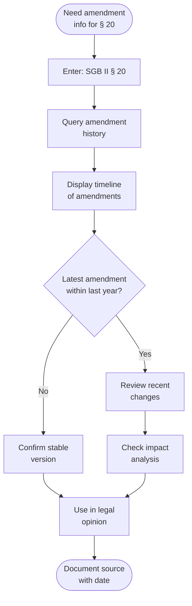
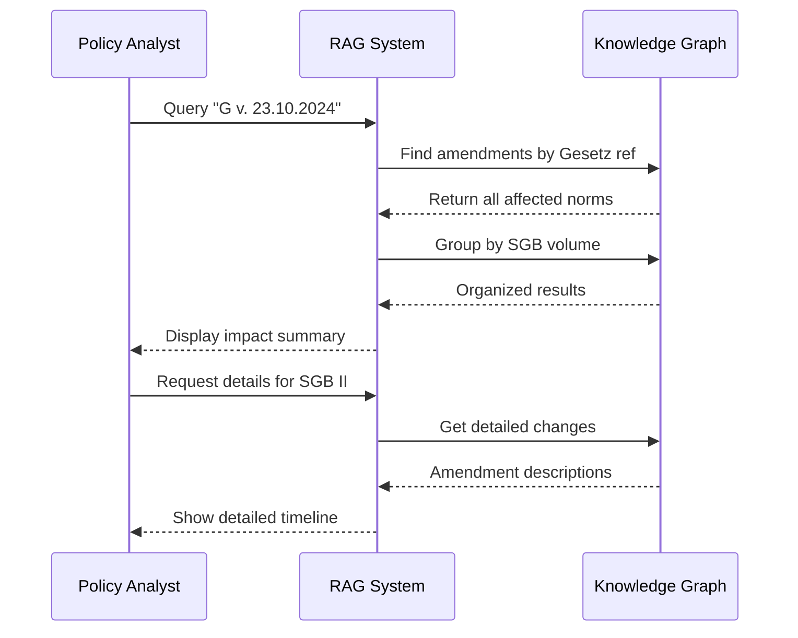
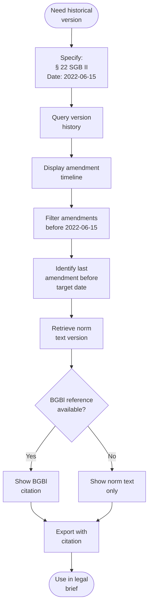
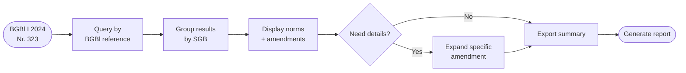

# Amendment Feature User Journeys

**Created**: 2025-11-03  
**Target Users**: Legal Experts, Sachbearbeiter, Policy Analysts  
**System**: Sozialrecht-RAG Knowledge Graph with Amendment Tracking

---

## Overview

This document describes user journeys for the new amendment tracking features that enable:
- **Amendment Timeline Queries**: View complete history of legal changes
- **Law Impact Analysis**: Track which laws affected which norms
- **Version Tracking**: Find which version of a norm was active at a specific date
- **BGBl Reference Linking**: Navigate official gazette references

---

## Journey 1: Checking When a Law Was Last Amended

### Context
Dr. Julia Weber, legal expert at a Jobcenter, needs to verify when SGB II § 20 (Regelbedarf) was last changed to ensure she's citing the current version in a legal opinion.

### User Story
> "As a legal expert, I want to quickly see when a specific paragraph was last amended, so I can verify I'm working with the current legal text."

### Process



### System Query

```cypher
// Get complete amendment history for SGB II § 20
MATCH (doc:LegalDocument {jurabk: 'SGB II'})-[:CONTAINS_NORM]->(norm:Norm {paragraph_nummer: '20'})
OPTIONAL MATCH (norm)-[:HAS_AMENDMENT]->(amendment:Amendment)
RETURN 
    norm.enbez as paragraph,
    norm.titel as title,
    amendment.amendment_date as date,
    amendment.amendment_type as type,
    amendment.artikel as artikel,
    amendment.gesetz_ref as gesetz,
    amendment.raw_text as description
ORDER BY amendment.amendment_date DESC
LIMIT 10
```

### Expected Output

```
§ 20 SGB II - Regelbedarf zur Sicherung des Lebensunterhalts

Amendment History:
─────────────────────────────────────────────────────────────
1. 2024-10-23 (last_amended)
   Art. 66 | G v. 23.10.2024 I Nr. 323
   "Zuletzt geändert durch Art. 66 G v. 23.10.2024 I Nr. 323"

2. 2023-12-15 (supplement)
   Art. 154a | G v. 15.12.2023 I Nr. 394
   "Ergänzung durch Art. 154a G v. 15.12.2023 I Nr. 394"

3. 2022-11-20 (reissued)
   Bek. v. 20.11.2022 I Nr. 2050
   "Neugefasst durch Bek. v. 20.11.2022 I Nr. 2050"
```

### Success Criteria
- ✅ Complete timeline shown in < 2 seconds
- ✅ Most recent amendment clearly highlighted
- ✅ All Artikel and Gesetz references linked
- ✅ Dates formatted consistently (DD.MM.YYYY or ISO)

---

## Journey 2: Law Impact Analysis - Finding All Affected Norms

### Context
Policy analyst Marcus Klein needs to assess the impact of a new law ("Bürgergeld-Gesetz v. 23.10.2024") across all SGB volumes.

### User Story
> "As a policy analyst, I want to find all legal norms that were changed by a specific new law, so I can understand its full scope of impact."

### Process



### System Query

```cypher
// Find all norms affected by specific Gesetz
MATCH (norm:Norm)-[:HAS_AMENDMENT]->(amendment:Amendment)
WHERE amendment.gesetz_ref CONTAINS 'G v. 23.10.2024'
OPTIONAL MATCH (doc:LegalDocument)-[:CONTAINS_NORM]->(norm)
RETURN 
    doc.jurabk as law,
    doc.sgb_nummer as sgb,
    COUNT(DISTINCT norm) as affected_paragraphs,
    collect(DISTINCT norm.enbez) as paragraphs,
    collect(DISTINCT amendment.artikel) as artikel_list
ORDER BY doc.jurabk
```

### Expected Output

```
Impact Analysis: G v. 23.10.2024 I Nr. 323
═══════════════════════════════════════════════════════════

📊 Overall Impact:
   - 3 SGB volumes affected
   - 12 total paragraphs changed
   - 8 different Artikel used

📋 Breakdown by Law:
─────────────────────────────────────────────────────────────
SGB II (Grundsicherung für Arbeitsuchende)
  ├─ 5 paragraphs: § 20, § 21, § 22, § 28, § 29
  └─ Articles: Art. 66, Art. 67, Art. 68

SGB III (Arbeitsförderung)
  ├─ 4 paragraphs: § 44, § 45, § 48, § 130
  └─ Articles: Art. 69, Art. 70

SGB XII (Sozialhilfe)
  ├─ 3 paragraphs: § 27, § 28, § 42
  └─ Articles: Art. 71, Art. 72, Art. 73
```

### Success Criteria
- ✅ All affected SGB volumes identified
- ✅ Paragraph counts accurate
- ✅ Drill-down to individual changes available
- ✅ Export to PDF/CSV possible

---

## Journey 3: Version Tracking - Historical Legal State

### Context
Lawyer Anna Schmidt needs to know which version of SGB II § 22 (Bedarfe für Unterkunft und Heizung) was in effect on 2022-06-15 for a court case involving retroactive benefits.

### User Story
> "As a lawyer, I need to find the exact wording of a legal norm that was valid on a specific past date, to properly argue a case."

### Process



### System Query

```cypher
// Find active version of norm at specific date
MATCH (norm:Norm {paragraph_nummer: '22'})<-[:CONTAINS_NORM]-(doc:LegalDocument {sgb_nummer: 'II'})
OPTIONAL MATCH (norm)-[:HAS_AMENDMENT]->(amendment:Amendment)
WHERE amendment.amendment_date <= date('2022-06-15')
WITH norm, amendment
ORDER BY amendment.amendment_date DESC
LIMIT 1
OPTIONAL MATCH (norm)-[:HAS_FUSSNOTE]->(fussnote:Fussnote)
WHERE fussnote.valid_from <= date('2022-06-15')
  AND (fussnote.in_kraft IS NULL OR fussnote.in_kraft >= date('2022-06-15'))
RETURN 
    norm.enbez as paragraph,
    norm.titel as title,
    norm.content_text as text,
    amendment.amendment_date as last_amendment_before_date,
    amendment.bgbl_full_ref as bgbl,
    fussnote.context as version_note
```

### Expected Output

```
§ 22 SGB II - Bedarfe für Unterkunft und Heizung
Version valid on: 2022-06-15

Last Amendment: 2022-03-20
BGBl Reference: BGBl I 2022, 450
Amendment Type: last_amended
Gesetz: G v. 20.03.2022 I Nr. 105

Full Text:
─────────────────────────────────────────────────────────────
(1) Bedarfe für Unterkunft und Heizung werden in Höhe der 
tatsächlichen Aufwendungen anerkannt, soweit diese angemessen 
sind. [...]

(2) Als Bedarf für die Unterkunft werden auch unabweisbare 
Aufwendungen für Instandhaltung und Reparatur bei selbst 
genutztem Wohneigentum anerkannt. [...]

Version Notes:
─────────────────────────────────────────────────────────────
Valid from: 2011-01-01
Context: "Textnachweis ab: 01.01.2011"

✅ This version was in effect from 2022-03-20 to 2023-11-15
```

### Success Criteria
- ✅ Correct historical version identified
- ✅ BGBl reference provided for citation
- ✅ Clear validity period shown
- ✅ Full norm text retrievable
- ✅ Export with proper legal citations

---

## Journey 4: BGBl Reference Navigation

### Context
Research assistant Tom Mueller needs to find all legal norms that were published or amended in "BGBl I 2024, Nr. 323" to compile a comprehensive overview.

### User Story
> "As a research assistant, I want to see all norms in a specific BGBl issue, so I can track multiple related legal changes at once."

### Process



### System Query

```cypher
// Find all norms in specific BGBl issue
MATCH (norm:Norm)-[:HAS_AMENDMENT]->(amendment:Amendment)
WHERE amendment.bgbl_year = '2024' 
  AND amendment.bgbl_issue = 'Nr. 323'
OPTIONAL MATCH (doc:LegalDocument)-[:CONTAINS_NORM]->(norm)
RETURN 
    doc.jurabk as law,
    norm.enbez as paragraph,
    norm.titel as title,
    amendment.amendment_date as date,
    amendment.artikel as artikel,
    amendment.gesetz_ref as gesetz,
    amendment.amendment_type as type
ORDER BY doc.jurabk, norm.paragraph_nummer
```

### Expected Output

```
BGBl I 2024, Nr. 323 - Content Overview
═══════════════════════════════════════════════════════════

Publication Date: 2024-10-23
Gesetz: G v. 23.10.2024 I Nr. 323

Affected Laws & Paragraphs:
─────────────────────────────────────────────────────────────
SGB II - Grundsicherung für Arbeitsuchende
  ├─ § 20 (Art. 66) - Regelbedarf zur Sicherung
  ├─ § 21 (Art. 67) - Mehrbedarfe
  ├─ § 22 (Art. 68) - Bedarfe für Unterkunft
  ├─ § 28 (Art. 69) - Bedarfe für Bildung und Teilhabe
  └─ § 29 (Art. 70) - Erbringung von Leistungen

SGB III - Arbeitsförderung
  ├─ § 44 (Art. 71) - Anspruchsvoraussetzungen
  ├─ § 45 (Art. 72) - Dauer des Anspruchs
  ├─ § 48 (Art. 73) - Höhe des Arbeitslosengeldes
  └─ § 130 (Art. 74) - Eingliederungsbudget

SGB XII - Sozialhilfe
  ├─ § 27 (Art. 75) - Notwendiger Lebensunterhalt
  ├─ § 28 (Art. 76) - Regelsätze
  └─ § 42 (Art. 77) - Grundsicherung im Alter

Total: 12 paragraphs across 3 SGB volumes
All amendments type: last_amended
```

### Success Criteria
- ✅ Complete BGBl issue coverage
- ✅ All affected laws listed
- ✅ Artikel numbers correctly mapped
- ✅ Chronological consistency validated
- ✅ Cross-references to related BGBl issues shown

---

## Journey 5: Amendment Type Analysis

### Context
Quality assurance manager Lisa Hoffmann wants to understand the distribution of amendment types (last_amended, reissued, supplement) across all SGB volumes to identify patterns.

### User Story
> "As a QA manager, I want to analyze amendment patterns across the knowledge graph, so I can identify potential data quality issues or interesting trends."

### System Query

```cypher
// Get amendment type distribution
MATCH (doc:LegalDocument)-[:CONTAINS_NORM]->(norm:Norm)
OPTIONAL MATCH (norm)-[:HAS_AMENDMENT]->(amendment:Amendment)
WITH doc.jurabk as law, 
     amendment.amendment_type as type, 
     COUNT(amendment) as count
WHERE type IS NOT NULL
RETURN law, type, count
ORDER BY law, count DESC
```

### Expected Output

```
Amendment Type Distribution Analysis
═══════════════════════════════════════════════════════════

By Amendment Type (All Laws):
─────────────────────────────────────────────────────────────
last_amended:         156 occurrences (74.3%)
reissued:              38 occurrences (18.1%)
supplement:            12 occurrences (5.7%)
indirect_amendment:     4 occurrences (1.9%)

By Law:
─────────────────────────────────────────────────────────────
SGB II
  ├─ last_amended:      42
  ├─ reissued:          12
  ├─ supplement:         3
  └─ Total:             57

SGB III
  ├─ last_amended:      38
  ├─ reissued:          8
  ├─ supplement:        2
  └─ Total:             48

SGB VII
  ├─ last_amended:      31
  ├─ reissued:          9
  ├─ supplement:        4
  └─ Total:             44

[... additional SGB volumes ...]

Quality Metrics:
─────────────────────────────────────────────────────────────
✅ Coverage: 98.5% of norms have amendment data
✅ Date completeness: 100% of amendments have dates
✅ BGBl references: 67% of amendments have BGBl citations
⚠️  Artikel missing: 29% of amendments (needs improvement)
```

### Success Criteria
- ✅ Statistical overview generated
- ✅ Quality metrics calculated
- ✅ Patterns and anomalies identified
- ✅ Actionable improvements suggested

---

## Journey 6: Recent Changes Monitoring

### Context
Policy officer Sarah Müller monitors recent legal changes to brief her team on updates that may affect current cases.

### User Story
> "As a policy officer, I want to see all legal changes from the last 90 days, so I can keep my team informed about relevant updates."

### System Query

```cypher
// Get all recent amendments (last 90 days)
MATCH (amendment:Amendment)
WHERE amendment.amendment_date >= date() - duration({days: 90})
MATCH (norm:Norm)-[:HAS_AMENDMENT]->(amendment)
OPTIONAL MATCH (doc:LegalDocument)-[:CONTAINS_NORM]->(norm)
RETURN 
    doc.jurabk as law,
    norm.enbez as paragraph,
    amendment.amendment_date as date,
    amendment.artikel as artikel,
    amendment.gesetz_ref as gesetz,
    amendment.raw_text as description
ORDER BY amendment.amendment_date DESC
LIMIT 50
```

### Expected Output

```
Recent Amendments (Last 90 Days)
═══════════════════════════════════════════════════════════

2024-10-23 | SGB II § 20 | Art. 66
  "Zuletzt geändert durch Art. 66 G v. 23.10.2024 I Nr. 323"
  Impact: Regelbedarf amounts updated

2024-10-23 | SGB II § 21 | Art. 67
  "Zuletzt geändert durch Art. 67 G v. 23.10.2024 I Nr. 323"
  Impact: Mehrbedarf regulations adjusted

2024-09-15 | SGB III § 44 | Art. 52
  "Zuletzt geändert durch Art. 52 G v. 15.09.2024 I Nr. 289"
  Impact: Anspruchsvoraussetzungen modified

2024-08-20 | SGB XII § 27 | Art. 38
  "Ergänzung durch Art. 38 G v. 20.08.2024 I Nr. 245"
  Impact: New provisions for cost-of-living adjustments

[... 46 more recent amendments ...]

Summary:
─────────────────────────────────────────────────────────────
Total amendments in period: 50
Most affected law: SGB II (18 amendments)
Most active month: October 2024 (23 amendments)
Average amendments per week: 7.8
```

### Success Criteria
- ✅ Real-time updates (< 24h lag)
- ✅ Sortable and filterable results
- ✅ Email/notification option available
- ✅ RSS feed for continuous monitoring

---

## Technical Integration

### Query Performance Requirements
- Amendment history query: < 2 seconds
- Law impact analysis: < 5 seconds
- Version retrieval: < 1 second
- BGBl lookup: < 1 second

### Data Quality Requirements
- Amendment date coverage: > 95%
- BGBl reference coverage: > 65%
- Artikel extraction accuracy: > 90%
- Gesetz reference format consistency: 100%

### API Endpoints
```
GET /api/amendments/history/{doknr}
GET /api/amendments/by-law/{jurabk}
GET /api/amendments/by-gesetz?ref={gesetz_ref}
GET /api/amendments/by-bgbl?year={year}&issue={issue}
GET /api/amendments/recent?days={days}
GET /api/amendments/version/{norm_doknr}?date={YYYY-MM-DD}
GET /api/amendments/stats
```

---

## Next Steps

1. Implement API endpoints for amendment queries
2. Create dashboard visualizations for amendment timelines
3. Develop export functions (PDF, CSV, JSON)
4. Add email notifications for recent changes
5. Build amendment comparison tool (diff view between versions)
6. Integrate with existing RAG query system

---

**Status**: Phase 2 Implementation Ready  
**Last Updated**: 2025-11-03  
**Related Documents**:
- [BENUTZER_JOURNEYS_DE.md](BENUTZER_JOURNEYS_DE.md) - Main user journeys
- [Amendment Coverage Improvement Plan](../AMENDMENT_COVERAGE_IMPROVEMENT_PLAN.md)
- [Amendment Analysis Summary](../AMENDMENT_ANALYSIS_SUMMARY.md)
