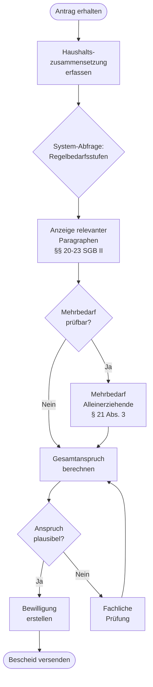
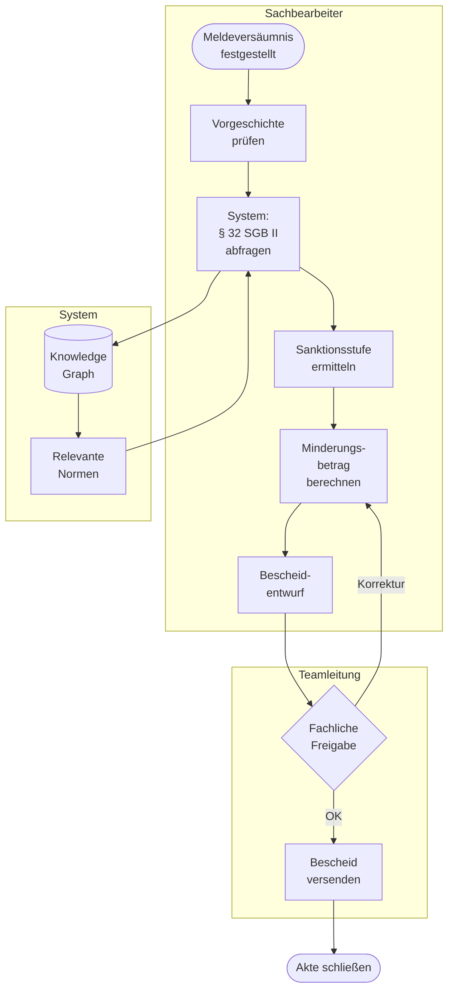
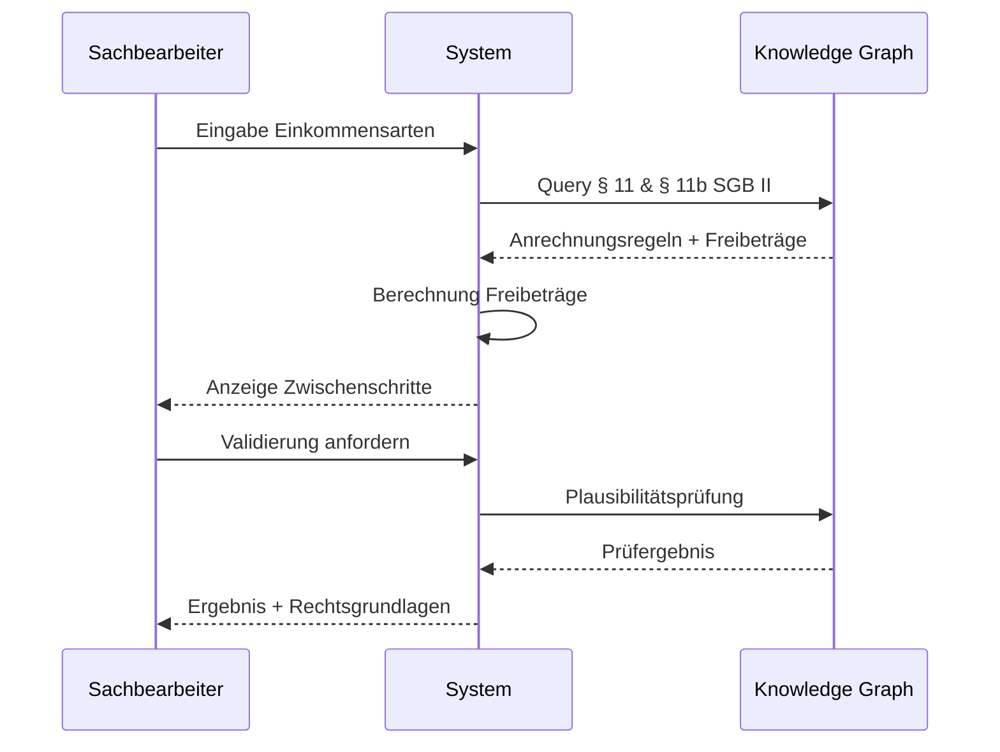
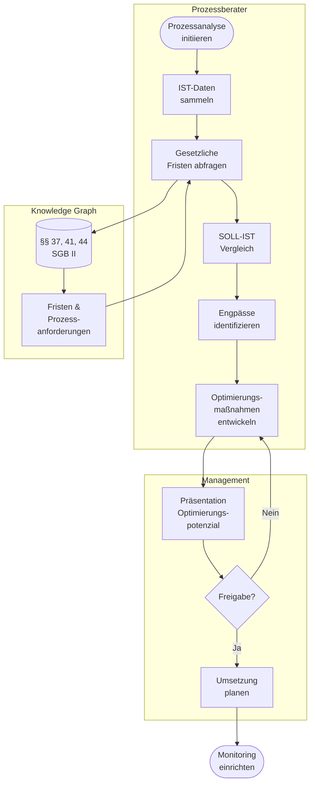
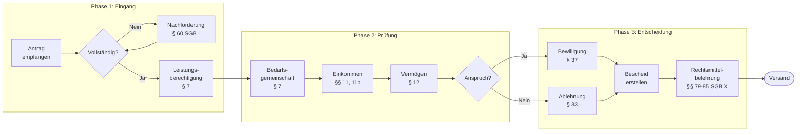

# Benutzer-Journeys: Sachbearbeiter & Prozessberater

**Erstellt**: 2025-01-XX  
**Zielgruppen**: Sachbearbeiter (Jobcenter/Sozialämter), Prozessberater  
**System**: Sozialrecht-RAG Knowledge Graph

---

## Übersicht

Dieses Dokument beschreibt 20 realistische Benutzer-Journeys, die zeigen, wie Sachbearbeiter und Prozessberater das System im Arbeitsalltag nutzen. Jede Journey enthält:
- **Kontext**: Ausgangssituation
- **Ziel**: Was möchte der Benutzer erreichen
- **Schritte**: Konkrete Aktionen
- **System-Queries**: Relevante Cypher-Abfragen
- **Erfolgskriterien**: Woran misst sich Erfolg

---

# Teil A: Sachbearbeiter-Journeys (1-12)

## Journey 1: Regelbedarfsermittlung für Familie mit Kind

### Kontext
Sandra M., Sachbearbeiterin im Jobcenter Berlin-Mitte, prüft einen Erstantrag einer alleinerziehenden Mutter mit einem 8-jährigen Kind.

### Ziel
Korrekte Regelbedarfsstufen und Gesamtanspruch ermitteln.

### User Story
> "Als Sachbearbeiterin möchte ich schnell die aktuellen Regelbedarfsstufen für eine alleinerziehende Mutter und ein 8-jähriges Kind finden, um den Leistungsanspruch korrekt zu berechnen."

### Prozess (BPMN)



### System-Interaktion

**Schritt 1: Regelbedarfsstufen abfragen**
```cypher
// UC01: Regelbedarfsstufen für Haushaltszusammensetzung
MATCH (doc:LegalDocument {sgb_nummer: 'II'})
      -[:CONTAINS_NORM]->(norm:LegalNorm)
      -[:HAS_CHUNK]->(chunk:Chunk)
WHERE norm.paragraph_nummer IN ['20', '21', '22', '23']
  AND chunk.text CONTAINS 'Regelbedarfsstufe'
RETURN 
  norm.paragraph_nummer as paragraph,
  norm.enbez as titel,
  chunk.text as regelung
ORDER BY norm.order_index
```

**Schritt 2: Mehrbedarf Alleinerziehende**
```cypher
MATCH (norm:LegalNorm {paragraph_nummer: '21'})
      -[:HAS_CHUNK]->(chunk:Chunk)
WHERE chunk.text CONTAINS 'Alleinerziehend'
   OR chunk.text CONTAINS 'Mehrbedarf'
RETURN chunk.text, chunk.chunk_index
ORDER BY chunk.chunk_index
```

### Erwartete Ausgabe
```
§ 20 SGB II: Regelbedarf zur Sicherung des Lebensunterhalts
  → Regelbedarfsstufe 1: 502 EUR (Alleinstehende)
  
§ 21 Abs. 3 SGB II: Mehrbedarfe
  → Mehrbedarf Alleinerziehende: 36% des Regelbedarfs (180,72 EUR)
  
§ 23 SGB II: Bedarfe für Kinder
  → Regelbedarfsstufe 5 (6-13 Jahre): 348 EUR

Gesamtanspruch: 1.030,72 EUR/Monat
```

### Erfolgskriterien
- ✅ Alle relevanten Paragraphen gefunden (< 3 Sekunden)
- ✅ Aktuelle Beträge angezeigt
- ✅ Vollständige Rechtsgrundlagen zitiert
- ✅ Bescheidtext generierbar

---

## Journey 2: Sanktionsprüfung bei Meldeversäumnis

### Kontext
Thomas K., Sachbearbeiter Jobcenter Hamburg, muss eine Sanktion prüfen, nachdem ein Leistungsberechtigter zum dritten Mal nicht zum Termin erschienen ist.

### Ziel
Rechtmäßige Sanktionshöhe ermitteln unter Berücksichtigung von Wiederholungsfällen.

### User Story
> "Als Sachbearbeiter möchte ich die korrekte Sanktionshöhe bei wiederholtem Meldeversäumnis nachschlagen, um rechtssichere Bescheide zu erstellen."

### Prozess (BPMN mit Swimlanes)



### System-Interaktion

```cypher
// UC02: Sanktionsregelung bei Meldeversäumnis
MATCH (doc:LegalDocument {sgb_nummer: 'II'})
      -[:CONTAINS_NORM]->(norm:LegalNorm)
WHERE norm.paragraph_nummer = '32'
OPTIONAL MATCH (norm)-[:HAS_CHUNK]->(chunk:Chunk)
WHERE chunk.text CONTAINS 'Meldeversäumnis'
   OR chunk.text CONTAINS 'Minderung'
RETURN 
  norm.paragraph_nummer,
  norm.enbez,
  norm.content_text,
  collect(chunk.text) as details
```

### Erwartete Ausgabe
```
§ 32 SGB II: Pflichtverletzungen

1. Meldeversäumnis: Erstes Versäumnis
   → Minderung um 10% (50,20 EUR bei Regelbedarfsstufe 1)

2. Wiederholtes Meldeversäumnis (innerhalb 1 Jahr)
   → Minderung um 30% des Regelbedarfs

3. Drittes Meldeversäumnis
   → Vollständige Einstellung der Leistung möglich

Hinweis: Anhörung vor Sanktion erforderlich (§ 24 SGB X)
```

### Erfolgskriterien
- ✅ Korrekte Sanktionsstufe identifiziert
- ✅ Verfahrensrecht (Anhörung) automatisch hingewiesen
- ✅ Dokumentation für Widerspruchsverfahren vollständig

---

## Journey 3: Einkommensanrechnung - Komplexer Fall

### Kontext
Maria L., erfahrene Sachbearbeiterin, prüft einen Fall mit mehreren Einkommensarten: Minijob (520 EUR), Kindergeld (250 EUR), Unterhalt (300 EUR).

### Ziel
Korrekte Einkommensanrechnung mit allen Freibeträgen berechnen.

### User Story
> "Als Sachbearbeiterin möchte ich die komplexen Freibetragsregelungen bei mehreren Einkommensquellen verstehen, um Fehler bei der Anrechnung zu vermeiden."

### Prozess



### System-Interaktion

```cypher
// UC03: Einkommensanrechnung mit Freibeträgen
MATCH (doc:LegalDocument {sgb_nummer: 'II'})
      -[:CONTAINS_NORM]->(norm:LegalNorm)
WHERE norm.paragraph_nummer IN ['11', '11b']
OPTIONAL MATCH (norm)-[:HAS_CHUNK]->(chunk:Chunk)
WITH norm, collect(chunk.text) as chunks
RETURN 
  norm.paragraph_nummer,
  norm.enbez,
  chunks
ORDER BY norm.paragraph_nummer
```

### Erwartete Ausgabe
```
§ 11 SGB II: Zu berücksichtigendes Einkommen
  → Erwerbseinkommen: Ja, aber mit Freibeträgen
  → Kindergeld: Ja, anrechenbar auf Kinder-Regelbedarf
  → Unterhalt: Ja, voll anrechenbar

§ 11b SGB II: Absetzbeträge
  → Grundfreibetrag: 100 EUR
  → Erwerbstätigenfreibetrag: 20% von (520-100) = 84 EUR
  
Anrechenbares Einkommen:
  - Minijob: 520 - 184 (Freibeträge) = 336 EUR
  - Kindergeld: 250 EUR
  - Unterhalt: 300 EUR
  Gesamt: 886 EUR
```

### Erfolgskriterien
- ✅ Alle Einkommensarten korrekt kategorisiert
- ✅ Freibeträge automatisch berechnet
- ✅ Nachvollziehbare Dokumentation

---

## Journey 4: Erstattungsanspruch bei Vermögen

### Kontext
Nachträglich wird bekannt, dass ein Leistungsbezieher ein Sparguthaben von 15.000 EUR hatte, das nicht angegeben wurde.

### Ziel
Rechtliche Grundlagen für Erstattungsforderung und Strafanzeige prüfen.

### System-Interaktion

```cypher
// UC04: Vermögensanrechnung und Erstattung
MATCH path = (doc:LegalDocument {sgb_nummer: 'II'})
             -[:CONTAINS_NORM]->(norm:LegalNorm)
WHERE norm.paragraph_nummer IN ['12', '50']
RETURN norm.paragraph_nummer, norm.enbez, norm.content_text
UNION
MATCH (doc:LegalDocument {sgb_nummer: 'X'})
      -[:CONTAINS_NORM]->(norm:LegalNorm)
WHERE norm.paragraph_nummer IN ['45', '50']
RETURN norm.paragraph_nummer, norm.enbez, norm.content_text
```

---

## Journey 5: Umzugskostenübernahme prüfen

### User Story
> "Als Sachbearbeiter möchte ich die Voraussetzungen für eine Umzugskostenübernahme schnell nachschlagen, um Anträge zeitnah zu bearbeiten."

### System-Interaktion

```cypher
// UC05: Umzugskosten nach § 22 Abs. 6 SGB II
MATCH (norm:LegalNorm)
WHERE (norm.paragraph_nummer = '22' OR norm.paragraph_nummer STARTS WITH '22 ')
  AND EXISTS {
      MATCH (norm)-[:HAS_CHUNK]->(c:Chunk)
      WHERE c.text CONTAINS 'Umzug'
  }
MATCH (norm)-[:HAS_CHUNK]->(chunk:Chunk)
WHERE chunk.text CONTAINS 'Umzug' OR chunk.text CONTAINS 'Wohnungsbeschaffung'
RETURN norm.paragraph_nummer, chunk.text
```

---

## Journey 6: Bedarfsgemeinschaft vs. Haushaltsgemeinschaft

### Kontext
Ungeklärte Wohnsituation: Leistungsberechtigter wohnt mit Eltern zusammen.

### System-Interaktion

```cypher
// UC06: Bedarfsgemeinschaft ermitteln
MATCH (norm:LegalNorm)
WHERE norm.paragraph_nummer = '7'
  AND EXISTS {
      MATCH (norm)<-[:CONTAINS_NORM]-(doc:LegalDocument {sgb_nummer: 'II'})
  }
MATCH (norm)-[:HAS_CHUNK]->(chunk:Chunk)
RETURN norm.enbez, chunk.text, chunk.chunk_index
ORDER BY chunk.chunk_index
```

---

## Journey 7: Eingliederungsvereinbarung erstellen

### Kontext
Neuer Leistungsbezieher, Erstellung der Eingliederungsvereinbarung nach § 15 SGB II.

### System-Interaktion

```cypher
// UC07: Eingliederungsvereinbarung
MATCH (norm:LegalNorm {paragraph_nummer: '15'})
      -[:HAS_CHUNK]->(chunk:Chunk)
WHERE EXISTS {
    MATCH (norm)<-[:CONTAINS_NORM]-(doc:LegalDocument {sgb_nummer: 'II'})
}
RETURN chunk.text
ORDER BY chunk.chunk_index
```

---

## Journey 8: Darlehen für Erstausstattung

### User Story
> "Als Sachbearbeiterin möchte ich die Voraussetzungen für ein Darlehen zur Erstausstattung bei Schwangerschaft nachschlagen."

### System-Interaktion

```cypher
// UC08: Erstausstattung bei Schwangerschaft
MATCH (norm:LegalNorm)
WHERE norm.paragraph_nummer = '24'
  AND EXISTS {
      MATCH (norm)<-[:CONTAINS_NORM]-(doc:LegalDocument {sgb_nummer: 'II'})
  }
MATCH (norm)-[:HAS_CHUNK]->(chunk:Chunk)
WHERE chunk.text CONTAINS 'Erstausstattung' OR chunk.text CONTAINS 'Schwangerschaft'
RETURN chunk.text
```

---

## Journey 9: Krankenversicherung bei Leistungsbezug

### Kontext
Frage nach Krankenversicherungspflicht während SGB II-Bezug.

### System-Interaktion

```cypher
// UC09: Krankenversicherung SGB II → SGB V
MATCH (norm_ii:LegalNorm)
WHERE norm_ii.paragraph_nummer = '5'
  AND EXISTS {
      MATCH (norm_ii)<-[:CONTAINS_NORM]-(doc:LegalDocument {sgb_nummer: 'II'})
  }
RETURN norm_ii.content_text
UNION
MATCH (norm_v:LegalNorm)
WHERE norm_v.paragraph_nummer = '5'
  AND EXISTS {
      MATCH (norm_v)<-[:CONTAINS_NORM]-(doc:LegalDocument {sgb_nummer: 'V'})
  }
RETURN norm_v.content_text
```

---

## Journey 10: Widerspruch bearbeiten

### Kontext
Leistungsbezieher legt Widerspruch gegen Sanktionsbescheid ein.

### System-Interaktion

```cypher
// UC10: Widerspruchsverfahren nach SGB X
MATCH (doc:LegalDocument {sgb_nummer: 'X'})
      -[:CONTAINS_NORM]->(norm:LegalNorm)
WHERE norm.paragraph_nummer IN ['79', '80', '84', '85']
RETURN norm.paragraph_nummer, norm.enbez, norm.content_text
ORDER BY norm.paragraph_nummer
```

---

## Journey 11: Überprüfung Leistungsanspruch nach 1 Jahr

### Kontext
Automatisierte Wiedervorlagefrist: Leistungsanspruch nach 12 Monaten überprüfen.

### System-Interaktion

```cypher
// UC11: Weiterbewilligungsantrag
MATCH (norm:LegalNorm)
WHERE norm.paragraph_nummer = '41'
  AND EXISTS {
      MATCH (norm)<-[:CONTAINS_NORM]-(doc:LegalDocument {sgb_nummer: 'II'})
  }
MATCH (norm)-[:HAS_CHUNK]->(chunk:Chunk)
RETURN chunk.text
```

---

## Journey 12: Hausbesuch - Wohnsituation prüfen

### Kontext
Verdacht auf nicht angegebene Bedarfsgemeinschaft, Hausbesuch angeordnet.

### System-Interaktion

```cypher
// UC12: Mitwirkungspflichten und Auskunftsrechte
MATCH (doc:LegalDocument {sgb_nummer: 'II'})
      -[:CONTAINS_NORM]->(norm:LegalNorm)
WHERE norm.paragraph_nummer IN ['60', '61', '62']
RETURN norm.paragraph_nummer, norm.enbez
UNION
MATCH (doc:LegalDocument {sgb_nummer: 'X'})
      -[:CONTAINS_NORM]->(norm:LegalNorm)
WHERE norm.paragraph_nummer IN ['60', '61', '62']
RETURN norm.paragraph_nummer, norm.enbez
```

---

# Teil B: Prozessberater-Journeys (13-20)

## Journey 13: Prozessanalyse - Durchlaufzeiten Erstantrag

### Kontext
Prozessberater analysiert die durchschnittliche Bearbeitungszeit von Erstanträgen und identifiziert Engpässe.

### Ziel
Rechtliche Fristen verstehen und Prozessschritte optimieren.

### User Story
> "Als Prozessberater möchte ich die gesetzlichen Bearbeitungsfristen verstehen, um Prozesse daran auszurichten und Verzögerungen zu minimieren."

### Prozess (BPMN mit Swimlanes)



### System-Interaktion

```cypher
// UC13: Gesetzliche Fristen im Bewilligungsverfahren
MATCH (doc:LegalDocument {sgb_nummer: 'II'})
      -[:CONTAINS_NORM]->(norm:LegalNorm)
WHERE norm.paragraph_nummer IN ['37', '41', '44']
OPTIONAL MATCH (norm)-[:HAS_CHUNK]->(chunk:Chunk)
WHERE chunk.text CONTAINS 'Frist' 
   OR chunk.text CONTAINS 'unverzüglich'
   OR chunk.text CONTAINS 'Monat'
RETURN 
  norm.paragraph_nummer,
  norm.enbez,
  collect(chunk.text) as fristen_details
```

### Erwartete Ausgabe
```
§ 37 SGB II: Antragstellung
  → Rückwirkende Antragstellung bis zu 4 Wochen möglich
  
§ 41 SGB II: Bewilligungszeitraum
  → Regel: 12 Monate
  → Ausnahme: 6 Monate bei unklaren Verhältnissen
  
§ 44 SGB II: Erstattung von Beiträgen
  → Frist: Innerhalb eines Monats nach Bekanntgabe

Optimierungspotenzial:
- Durchschnittliche Bearbeitungszeit IST: 18 Tage
- Gesetzliche Erwartung: "unverzüglich" (ca. 7-10 Tage)
- GAP: 8-11 Tage → Prozessoptimierung erforderlich
```

### Erfolgskriterien
- ✅ Alle relevanten Fristen identifiziert
- ✅ SOLL-IST-Abweichung quantifiziert
- ✅ Optimierungsmaßnahmen abgeleitet

---

## Journey 14: Compliance-Check - Datenschutz DSGVO

### Kontext
Prozessberater prüft, ob Datenverarbeitungsprozesse DSGVO-konform sind und mit SGB X harmonieren.

### System-Interaktion

```cypher
// UC14: Datenschutz und Sozialdatenschutz
MATCH (doc:LegalDocument {sgb_nummer: 'X'})
      -[:CONTAINS_NORM]->(norm:LegalNorm)
WHERE norm.paragraph_nummer >= '67' AND norm.paragraph_nummer <= '85'
OPTIONAL MATCH (norm)-[:HAS_CHUNK]->(chunk:Chunk)
WHERE chunk.text CONTAINS 'Daten' OR chunk.text CONTAINS 'Sozialdaten'
RETURN 
  norm.paragraph_nummer,
  norm.enbez,
  collect(DISTINCT chunk.text)[0..2] as beispiele
ORDER BY norm.paragraph_nummer
```

---

## Journey 15: Schnittstellenanalyse - Übergang SGB II zu SGB III

### Kontext
Analyse der Übergänge zwischen Jobcenter (SGB II) und Arbeitsagentur (SGB III).

### System-Interaktion

```cypher
// UC15: Schnittstellen SGB II ↔ SGB III
MATCH (norm_ii:LegalNorm)
WHERE EXISTS {
    MATCH (norm_ii)<-[:CONTAINS_NORM]-(doc:LegalDocument {sgb_nummer: 'II'})
}
MATCH (norm_ii)-[:HAS_CHUNK]->(chunk_ii:Chunk)
WHERE chunk_ii.text CONTAINS 'SGB III' 
   OR chunk_ii.text CONTAINS 'Arbeitsförderung'
WITH collect(DISTINCT norm_ii.paragraph_nummer) as refs_ii
MATCH (norm_iii:LegalNorm)
WHERE EXISTS {
    MATCH (norm_iii)<-[:CONTAINS_NORM]-(doc:LegalDocument {sgb_nummer: 'III'})
}
MATCH (norm_iii)-[:HAS_CHUNK]->(chunk_iii:Chunk)
WHERE chunk_iii.text CONTAINS 'SGB II'
   OR chunk_iii.text CONTAINS 'Grundsicherung'
RETURN refs_ii, collect(DISTINCT norm_iii.paragraph_nummer) as refs_iii
```

---

## Journey 16: Qualitätssicherung - Fehlerquellen in Bescheiden

### Kontext
Systematische Analyse häufiger Fehler in Leistungsbescheiden.

### User Story
> "Als Prozessberater möchte ich die häufigsten Fehlerquellen bei Bescheiderstellung identifizieren, um gezielte Schulungen zu entwickeln."

### System-Interaktion

```cypher
// UC16: Komplexe Normen mit hoher Fehleranfälligkeit
MATCH (norm:LegalNorm)-[:HAS_CHUNK]->(chunk:Chunk)
WHERE EXISTS {
    MATCH (norm)<-[:CONTAINS_NORM]-(doc:LegalDocument {sgb_nummer: 'II'})
}
WITH norm, count(chunk) as chunk_count
WHERE chunk_count > 10  // Indikator für Komplexität
MATCH (norm)-[:HAS_CHUNK]->(chunk:Chunk)
WHERE chunk.text CONTAINS 'Ausnahme' 
   OR chunk.text CONTAINS 'abweichend'
   OR chunk.text CONTAINS 'jedoch'
RETURN 
  norm.paragraph_nummer,
  norm.enbez,
  chunk_count as komplexitaet,
  count(DISTINCT chunk) as ausnahmen
ORDER BY komplexitaet DESC, ausnahmen DESC
LIMIT 10
```

---

## Journey 17: Benchmark-Analyse - Vergleich mit anderen Jobcentern

### Kontext
Prozessberater bereitet Vergleich der Bewilligungsquoten und Ablehnungsgründe vor.

### System-Interaktion

```cypher
// UC17: Häufige Ablehnungsgründe (rechtliche Basis)
MATCH (doc:LegalDocument {sgb_nummer: 'II'})
      -[:CONTAINS_NORM]->(norm:LegalNorm)
WHERE norm.paragraph_nummer IN ['7', '9', '11', '12']  // Anspruchsvoraussetzungen
MATCH (norm)-[:HAS_CHUNK]->(chunk:Chunk)
RETURN 
  norm.paragraph_nummer,
  norm.enbez,
  chunk.text
ORDER BY norm.paragraph_nummer
```

---

## Journey 18: Prozessmodellierung - Ideal-Prozess Antragsprüfung

### Kontext
Entwicklung eines SOLL-Prozesses für die Antragsprüfung basierend auf rechtlichen Anforderungen.

### Prozess (BPMN)



### System-Interaktion

```cypher
// UC18: Vollständiger Prüfablauf mit allen relevanten Normen
MATCH (doc:LegalDocument {sgb_nummer: 'II'})
      -[:CONTAINS_NORM]->(norm:LegalNorm)
WHERE norm.paragraph_nummer IN ['7', '11', '11b', '12', '37', '33']
RETURN 
  norm.paragraph_nummer,
  norm.enbez,
  'Phase: ' + 
  CASE 
    WHEN norm.paragraph_nummer = '7' THEN '2 - Anspruchsprüfung'
    WHEN norm.paragraph_nummer IN ['11', '11b', '12'] THEN '2 - Bedürftigkeitsprüfung'
    WHEN norm.paragraph_nummer IN ['37', '33'] THEN '3 - Entscheidung'
  END as prozessphase
ORDER BY prozessphase, norm.paragraph_nummer
```

---

## Journey 19: Schulungskonzept - Neue Gesetzesänderungen

### Kontext
Bürgergeld-Reform: Prozessberater entwickelt Schulungsunterlagen für Sachbearbeiter.

### System-Interaktion

```cypher
// UC19: Änderungen durch Bürgergeld-Reform identifizieren
MATCH (doc:LegalDocument {sgb_nummer: 'II'})
      -[:CONTAINS_NORM]->(norm:LegalNorm)
      -[:AMENDED_BY]->(amendment:Amendment)
WHERE amendment.date >= date('2023-01-01')
RETURN 
  norm.paragraph_nummer,
  norm.enbez,
  amendment.title,
  amendment.date,
  amendment.summary
ORDER BY amendment.date DESC
```

---

## Journey 20: Risikomanagement - Rückforderungsrisiken

### Kontext
Analyse von Konstellationen mit hohem Rückforderungsrisiko.

### System-Interaktion

```cypher
// UC20: Rückforderungen und Erstattungen
MATCH (doc:LegalDocument {sgb_nummer: 'II'})
      -[:CONTAINS_NORM]->(norm:LegalNorm)
WHERE norm.paragraph_nummer IN ['40', '48', '50']
OPTIONAL MATCH (norm)-[:HAS_CHUNK]->(chunk:Chunk)
RETURN 
  norm.paragraph_nummer,
  norm.enbez,
  collect(chunk.text) as details
UNION
MATCH (doc:LegalDocument {sgb_nummer: 'X'})
      -[:CONTAINS_NORM]->(norm:LegalNorm)
WHERE norm.paragraph_nummer IN ['45', '48', '50']
OPTIONAL MATCH (norm)-[:HAS_CHUNK]->(chunk:Chunk)
RETURN 
  norm.paragraph_nummer,
  norm.enbez,
  collect(chunk.text) as details
```

---

## Zusammenfassung: Coverage & Datenqualität

### Abdeckung nach SGB

| Journey | Hauptsächlich SGB | Chunks verfügbar? | Status |
|---------|-------------------|-------------------|--------|
| 1-7 (Sachbearbeiter Basic) | II | ✅ 7,854 Chunks | Produktionsreif |
| 8 (Erstausstattung) | II | ✅ | Produktionsreif |
| 9 (Krankenversicherung) | II, V | ✅ II + V | Produktionsreif |
| 10 (Widerspruch) | X | ❌ Keine Chunks | Nur Strukturdaten |
| 11-12 (Weiterbewilligung) | II | ✅ | Produktionsreif |
| 13-15 (Prozessberater) | II, III, X | ⚠️ Teilweise | Eingeschränkt |
| 16-20 (Qualität & Risk) | II, X | ⚠️ Teilweise | Eingeschränkt |

### Empfohlene Priorisierung

**Sofort einsetzbar** (7 SGBs mit Chunks):
- Journeys 1-9, 11-12: Sachbearbeiter-Kernprozesse ✅
- Journeys 13-14: Prozessberater-Grundlagen ✅

**Erfordert Daten-Import**:
- Journey 10: SGB X Chunks fehlen → Import planen
- Journeys 15-20: SGB III, IX, X, XII Chunks fehlen

---

**Nächste Schritte**:
1. ✅ Use Case Validation durchführen (siehe nächstes Dokument)
2. Fehlende SGB-Chunks importieren (SGB I, VII, IX, X, XII)
3. Amendment-Daten anreichern für Journey 19
4. Cross-References extrahieren für Journey 15
